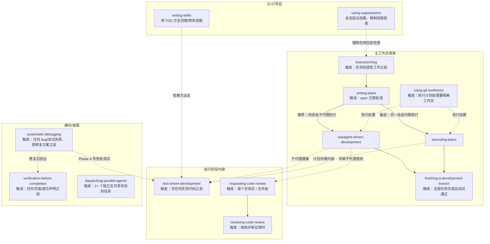

# Superpowers 技能系统架构解析

> 本文档是对 Superpowers 仓库中 14 个核心技能（skills）的系统性梳理，目的是在提出任何工作流优化建议之前，先建立对"技能如何设计、如何触发、如何互相衔接"的准确共识。本文只做描述与解释，不做优化建议。所有内容均忠实于各技能 `SKILL.md` 的实际文本（截至撰写时的 main 分支）。

---

## 一、整体设计理念

### 1.1 为什么是"可组合的技能"，而不是一个大 Prompt

Superpowers 的核心假设是：AI agent 天然倾向于**跳过流程直接写代码**——不问清需求、不写测试、不做验证就宣称完成。README 对此的定位很直白：写出来的实现计划要假设执行者是"一个热情但品味差、没有判断力、不了解项目背景、且讨厌写测试的初级工程师"（an enthusiastic junior engineer with poor taste, no judgement, no project context, and an aversion to testing）。

对抗这种倾向的方式不是一段笼统的系统提示，而是把每个工程环节（需求澄清、隔离工作区、写计划、执行、测试、代码评审、收尾、调试、验证）各自封装成一个**独立、可按需加载的技能文档**。每个技能：

- 有明确的**触发条件**（frontmatter 里的 `description` 只描述"何时使用"，刻意不概括"做什么"——因为测试发现如果 description 概括了流程，agent 会照着 description 的简写执行而跳过正文）；
- 有完整的**内部流程**（步骤、检查清单、流程图、状态机）；
- 有针对性的**反理由化（anti-rationalization）内容**——Red Flags 表格、"借口 vs 现实"对照表，专门堵住 agent 在压力下给自己找的借口。

README 概括的四条哲学：**Test-Driven Development**（测试先行）、**Systematic over ad-hoc**（系统化流程优于临场发挥）、**Complexity reduction**（无情地降低复杂度）、**Evidence over claims**（先验证、后声明）。

### 1.2 Bootstrap 机制：using-superpowers 如何强制"先查技能"

`using-superpowers` 是整个系统的引导层（bootstrap），由各个 harness（宿主环境）在**会话启动时**自动加载。它建立了一条不可协商的硬规则：

> "If you think there is even a 1% chance a skill might apply to what you are doing, you ABSOLUTELY MUST invoke the skill."（哪怕只有 1% 的可能某个技能适用，也必须调用它）

并且规定技能检查必须发生在**任何回应之前**——包括澄清性提问之前。它自带一张 Red Flags 表格，逐条否定常见的逃避理由（"这只是个简单问题"、"我需要先了解上下文"、"我记得这个技能的内容"等）。

它同时定义了**指令优先级**：

1. 用户的明确指令（CLAUDE.md / GEMINI.md / AGENTS.md / 直接要求）——最高
2. Superpowers 技能——覆盖默认系统行为
3. 默认系统提示——最低

以及**多技能同时适用时的优先序**：流程类技能（brainstorming、debugging——决定"如何着手"）先于实现细节类技能。

### 1.3 Rigid vs Flexible：两类技能

`using-superpowers` 明确区分两类技能，且"由技能自身声明属于哪类"：

- **Rigid（刚性）**：如 TDD、systematic-debugging——必须逐字遵守，不允许"因地制宜"地弱化纪律。这类技能正文里通常带有标志性句式："**Violating the letter of the rules is violating the spirit of the rules**"（违反字面即违反精神）和 "Iron Law"（铁律）段落。属于此类的还有 verification-before-completion 和 writing-skills。
- **Flexible（柔性）**：模式/技巧类——原则可以适配上下文。如 dispatching-parallel-agents 这类"pattern"。

### 1.4 跨 Harness 设计

技能本身不绑定任何一个 AI 工具。每个 harness（Claude Code、Codex、Copilot CLI、Gemini CLI 等）通过自己的引导机制在会话启动时加载 `using-superpowers`，再由它指引 agent 用该平台的技能调用工具（Claude Code 的 `Skill` 工具、Copilot 的 `skill` 工具、Gemini 的 `activate_skill`）。平台间的工具名差异由 `using-superpowers/references/` 下的映射文件（codex-tools.md、copilot-tools.md、gemini-tools.md）解决。

仓库 CLAUDE.md 中"New Harness Support"一节定义了集成是否成立的**验收测试**：新开一个干净会话，发送"Let's make a react todo list"，`brainstorming` 技能必须**自动触发**、在写任何代码之前介入。做不到这一点的集成（手工复制技能文件、运行时 shim、需要用户每次手动开启）一律不被接受。

顺带说明：仓库 CLAUDE.md 本身是贡献者规范（该仓库 PR 拒绝率 94%，明确禁止在没有评测证据的情况下改动精心调校过的技能内容，如 Red Flags 表、rationalization 列表、"your human partner"措辞等）。这解释了技能文本为什么刻意保持刚性、简练、带有大量"堵借口"的内容——它们是被反复实测调校过的行为塑造代码，而非普通文档。

---

## 二、技能全景关系图

### 2.1 三层结构

14 个技能可分为三层：

1. **元/引导层（Meta）**：`using-superpowers`（会话启动时加载，强制技能检查）、`writing-skills`（创建/修改技能本身的方法论）。
2. **主工作流骨架（Sequential Spine）**：从想法到合入的一条主线，每个技能的终态就是调用下一个技能：

   brainstorming → using-git-worktrees → writing-plans → (subagent-driven-development 或 executing-plans) → finishing-a-development-branch

   其中 test-driven-development 和 requesting-code-review / receiving-code-review 是被执行阶段**内嵌调用**的（TDD 由计划的每个任务步骤和 implementer 子代理遵循；code review 在每个任务后和合并前触发），而非独立的顺序节点。
3. **横切/按需工具（Cross-cutting）**：任意时点都可能触发——`systematic-debugging`（遇到任何 bug / 测试失败时）、`verification-before-completion`（任何"宣称完成"之前）、`dispatching-parallel-agents`（出现 2+ 个相互独立的任务时）、`receiving-code-review`（收到评审意见时）。

### 2.2 关系图

### 2.3 各技能的触发条件速查

| 技能 | 触发条件（来自各自 description / 正文） |
|------|------|
| using-superpowers | 任何会话开始时（"Use when starting any conversation"）；每次响应前、甚至 EnterPlanMode 前都要过它的流程图 |
| brainstorming | 任何创造性工作之前——新功能、新组件、新行为、行为修改（"You MUST use this before any creative work"）；即将 EnterPlanMode 但还没 brainstorm 过时也会被 using-superpowers 的流程图强制拉起 |
| using-git-worktrees | 开始需要隔离的功能开发时、执行实现计划之前 |
| writing-plans | 已有 spec 或多步骤任务的需求、动代码之前 |
| subagent-driven-development | 有实现计划 + 任务大体独立 + 留在当前会话执行 |
| executing-plans | 有书面实现计划，需要在**另一个会话**带检查点执行 |
| test-driven-development | 实现任何 feature 或 bugfix、写实现代码之前 |
| requesting-code-review | 完成任务后、完成大功能后、合并 main 之前（强制）；卡住时（可选） |
| receiving-code-review | 收到评审反馈、准备落实建议之前 |
| finishing-a-development-branch | 实现完成、所有测试通过、需要决定如何整合工作时 |
| dispatching-parallel-agents | 面对 2+ 个无共享状态、无顺序依赖的独立任务时 |
| systematic-debugging | 遇到任何 bug、测试失败、非预期行为，**在提出修复之前** |
| verification-before-completion | 即将宣称工作完成/修好/通过，提交或建 PR 之前 |
| writing-skills | 创建新技能、编辑现有技能、部署前验证技能时 |

---

## 三、逐个技能详解

### 3.1 using-superpowers（引导 / 元技能）

- **一句话作用**：会话启动时加载的引导技能，强制 agent 在任何回应之前检查并调用适用的技能。
- **触发时机**：任何会话开始（由 harness 的 bootstrap 机制注入）；此后每收到一条用户消息、每次准备进入 plan mode，都要走它的决策流程。带有 `<SUBAGENT-STOP>` 标记：被派遣执行具体任务的子代理跳过此技能。
- **内部流程**：核心是一张 graphviz 决策图——"收到用户消息 → 可能有技能适用吗？→ 哪怕 1% 也要调用 Skill 工具 → 宣告 'Using [skill] to [purpose]' → 技能有 checklist 吗？→ 有则为每一项创建 TodoWrite 待办 → 严格按技能执行 → 才能回应（包括澄清性问题）"。另有一条专门的入口："即将 EnterPlanMode？→ 已经 brainstorm 过了吗？→ 没有则先调用 brainstorming"。配套一张 12 行的 Red Flags 表，逐条驳斥跳过技能检查的借口。
- **产出物**：无直接产出物；它塑造的是整个会话的行为模式（技能调用 + 宣告 + TodoWrite 待办）。
- **衔接关系**：是所有其他技能的入口闸门。定义了指令优先级（用户指令 > 技能 > 默认系统提示）和技能优先级（流程类先于实现类）。
- **刚性/柔性**：本身定义了这套分类；其"1% 规则"本身是不可协商的刚性规则。

### 3.2 brainstorming（需求澄清与设计）

- **一句话作用**：通过一次一问的自然对话，把想法打磨成经用户逐节批准的设计文档（spec）。
- **触发时机**：任何创造性工作之前——"creating features, building components, adding functionality, or modifying behavior"。是主工作流的第一站，也是 harness 集成验收测试的检验对象。
- **内部流程**：带 `<HARD-GATE>`（硬闸门）——在展示设计并获用户批准之前，禁止调用任何实现技能、写任何代码、搭任何脚手架，"不管项目看起来多简单"。正文专门驳斥"这太简单了不需要设计"的反模式。9 项强制 checklist（每项都要建 TodoWrite 待办，按序完成）：
  1. 探索项目上下文（文件、文档、近期提交）；
  2. （若话题涉及视觉问题）提供 Visual Companion——必须单独成一条消息；
  3. 一次一个澄清问题（优先多选题），理解目的/约束/成功标准；
  4. 提出 2-3 种方案及权衡，给出推荐；
  5. 按复杂度分节呈现设计，每节获得用户认可（覆盖架构、组件、数据流、错误处理、测试）；
  6. 把设计文档写入 `docs/superpowers/specs/YYYY-MM-DD-<topic>-design.md` 并提交 git；
  7. Spec 自审（inline 快速检查）：占位符扫描、内部一致性、范围检查（是否需要拆解）、歧义检查——发现问题当场改；
  8. 用户审阅书面 spec（明确的用户审阅闸门，等待回复）；
  9. 过渡到实现——调用 writing-plans。
  另有范围检查：若请求涉及多个独立子系统，先帮用户分解成子项目，每个子项目各自走 spec → plan → 实现的循环。
- **产出物**：一份提交到 git 的设计文档（spec），路径 `docs/superpowers/specs/`。
- **衔接关系**："**The terminal state is invoking writing-plans**"——brainstorming 之后唯一允许调用的技能就是 writing-plans，明确禁止直接跳到任何实现技能。配套文件：`visual-companion.md`（浏览器可视化伴侣的详细指南，含本地服务脚本）、`spec-document-reviewer-prompt.md`（spec 评审子代理的提示模板，检查完整性/一致性/清晰度/范围/YAGNI，仅在真正会导致计划出错的问题上卡审批）。
- **刚性/柔性**：checklist 与 HARD-GATE 是刚性的；提问方式与设计呈现的详略是柔性的（"Be flexible - 讲不通就回头澄清"）。

### 3.3 using-git-worktrees（隔离工作区）

- **一句话作用**：确保开发工作在隔离的工作区中进行——优先用平台原生 worktree 工具，无原生工具时回落到手工 git worktree。
- **触发时机**：开始需要与当前工作区隔离的功能开发时、执行实现计划之前。
- **内部流程**：核心原则"先探测已有隔离，再用原生工具，最后才回落到 git，绝不与 harness 对抗"。步骤：
  - **Step 0 探测既有隔离**：比较 `git rev-parse --git-dir` 与 `--git-common-dir`；二者不同（且排除 submodule）说明已在 linked worktree 中，直接跳到 Step 3，禁止套娃创建。若在普通仓库中，先确认用户偏好或征求同意（"要不要建隔离 worktree 保护当前分支？"），用户拒绝则原地工作。
  - **Step 1a 原生工具优先**：有 `EnterWorktree`、`WorktreeCreate`、`/worktree` 之类的原生工具就用它——"用 `git worktree add` 绕过原生工具是头号错误"。
  - **Step 1b git 回落**：目录选择优先级为"用户声明的偏好 > 项目内已有 `.worktrees/` 或 `worktrees/` > 遗留全局路径 `~/.config/superpowers/worktrees/<project>` > 默认 `.worktrees/`"；项目内目录**必须**先用 `git check-ignore` 验证已被忽略（否则先补 .gitignore 并提交），再 `git worktree add`；沙箱权限失败则告知用户并原地工作。
  - **Step 3 项目安装**：按 package.json / Cargo.toml / requirements.txt / go.mod 自动安装依赖。
  - **Step 4 验证干净基线**：跑测试套件；失败则报告并询问是否继续（不允许默默带病开工），通过则报告"Worktree ready at <path>, N tests passing"。
  - （注：SKILL.md 的编号从 Step 1 直接跳到 Step 3，没有 Step 2——这是文件现状。）
- **产出物**：一个依赖已装好、测试基线为绿的隔离工作区（worktree + 新分支）。
- **衔接关系**：是 subagent-driven-development 和 executing-plans 声明的"Required workflow skill"（执行前置）；它创建的 worktree 最终由 finishing-a-development-branch 按归属（provenance）清理。
- **刚性/柔性**：探测顺序、ignore 验证、基线测试是刚性的（有 Red Flags 清单）；目录位置尊重用户偏好，属柔性适配。

### 3.4 writing-plans（编写实现计划）

- **一句话作用**：把批准的 spec 转写成"零上下文工程师也能照做"的、以 2-5 分钟微步骤为粒度的实现计划。
- **触发时机**：已有 spec 或多步骤任务需求、动代码之前（通常由 brainstorming 的终态直接调用）。
- **内部流程**：
  1. **范围检查**：spec 若覆盖多个独立子系统（本应在 brainstorming 阶段拆掉），建议拆成多份计划，每份都要能独立产出可运行、可测试的软件。
  2. **文件结构先行**：定义任务之前先画出要创建/修改的文件清单及各自职责——"这是分解决策被锁定的地方"。
  3. **强制文档头**：每份计划必须以固定 header 开头，其中包含给 agent 执行者的指令："REQUIRED SUB-SKILL: Use superpowers:subagent-driven-development (recommended) or superpowers:executing-plans"，加 Goal / Architecture / Tech Stack。
  4. **任务结构**：每个 Task 列出精确文件路径（Create/Modify/Test），步骤全部用 `- [ ]` checkbox，遵循 TDD 节奏："写失败测试 → 运行确认失败（含预期报错信息）→ 写最小实现 → 运行确认通过 → 提交"，每步 2-5 分钟，代码步骤必须给出完整代码块、命令步骤给出确切命令和预期输出。
  5. **No Placeholders 规则**："TBD"、"TODO"、"add appropriate error handling"、"similar to Task N"（必须重复贴代码，因为执行者可能乱序阅读）等一律视为**计划失败**。
  6. **Self-Review（自审，明确说明"是你自己跑的 checklist，不派子代理"）**：spec 覆盖率逐节核对、占位符扫描、跨任务类型/签名一致性检查（Task 3 叫 `clearLayers()` 而 Task 7 叫 `clearFullLayers()` 就是 bug），问题当场修。
  7. **执行方式交接**：保存后向用户提供二选一——"1. Subagent-Driven（推荐）：每任务派新子代理+任务间评审；2. Inline Execution：用 executing-plans 批量执行带检查点"。
- **产出物**：`docs/superpowers/plans/YYYY-MM-DD-<feature-name>.md` 的计划文档。
- **衔接关系**：上游收 brainstorming 产出的 spec；下游按用户选择交给 subagent-driven-development 或 executing-plans。目录下另有 `plan-document-reviewer-prompt.md`（计划评审子代理模板：查完整性/spec 对齐/任务分解/可执行性，只在真正会卡住实现者的问题上打回）。
- **刚性/柔性**：粒度规范、No Placeholders、文档头是刚性要求。

### 3.5 subagent-driven-development（子代理驱动开发，推荐执行路径）

- **一句话作用**：在当前会话内，为计划中的每个任务派遣一个全新的实现者子代理，并在每个任务后执行"先 spec 合规、再代码质量"的两阶段评审。
- **触发时机**：有实现计划 + 任务大体独立 + 留在当前会话执行（其"When to Use"流程图明确了这三个判断分支；任务紧耦合则不适用，需换会话则用 executing-plans）。
- **内部流程**：
  1. **准备**：控制者读一遍计划文件，**提取全部任务的完整文本和上下文**，创建 TodoWrite——之后不让子代理自己读计划文件（"Make subagent read plan file"是 Red Flag，必须把全文喂给它）。
  2. **每任务循环**：按 `implementer-prompt.md` 派实现者子代理（任务全文 + 场景上下文；子代理**开工前可以提问**，控制者必须先答完再放行）→ 子代理实现、测试、提交、**自审**（完整性/质量/YAGNI 纪律/测试真实性四个维度，发现问题先修再汇报）→ 派 **spec 合规评审者**（`spec-reviewer-prompt.md`，核心指令是"**Do Not Trust the Report**"——实现者完成得可疑地快，必须读实际代码逐行对照需求，查缺失、查多余、查误解）→ 不合规则实现者修、评审者复审，直到 ✅ → 才派**代码质量评审者**（`code-quality-reviewer-prompt.md`，复用 requesting-code-review 的模板，附加检查文件职责单一性、单元可独立测试性、是否遵循计划的文件结构）→ 有问题同样"修 → 复审"循环 → 两审全过才在 TodoWrite 标记任务完成。
  3. **收尾**：所有任务完成后，派最终代码评审者审整个实现，然后调用 finishing-a-development-branch。
  - **连续执行原则**：任务之间不向用户请示（"Should I continue?" 被明确禁止），只有三种停下的理由：无法解决的 BLOCKED、真正阻碍进展的歧义、全部完成。
  - **模型分级**：机械性任务（1-2 个文件、spec 完整）用便宜快速模型；多文件集成用标准模型；架构/设计/评审用最强模型。
  - **实现者四态协议**：DONE（进评审）/ DONE_WITH_CONCERNS（先读疑虑再决定）/ NEEDS_CONTEXT（补上下文重派）/ BLOCKED（判断是上下文问题→补充、推理不够→换更强模型、任务太大→拆小、计划本身有错→升级给人类）。"绝不无视升级、绝不让同一模型原样重试"。
- **产出物**：逐任务提交的 git commit 序列，每个都通过了双阶段评审；TodoWrite 进度记录。
- **衔接关系**：上游由 writing-plans 交接；声明的必需技能包括 using-git-worktrees（前置隔离）、requesting-code-review（评审模板）、finishing-a-development-branch（收尾）；子代理应遵循 test-driven-development。Red Flags 里明确"**先跑代码质量评审、后跑 spec 合规是错误顺序**"、"不得并行派多个实现子代理（会冲突）"、"不要亲手替子代理修（污染控制者上下文），派修复子代理"。
- **刚性/柔性**：评审顺序、循环、四态协议是刚性的。

### 3.6 executing-plans（内联执行计划，备选路径）

- **一句话作用**：在（通常是另一个）会话中加载计划、批判性审阅后逐任务照做，遇阻即停。
- **触发时机**：有书面实现计划、要在单独会话里带检查点执行时。技能开头就要求告知用户："Superpowers 在有子代理支持的平台上效果好得多，如果有子代理可用，请改用 subagent-driven-development"。
- **内部流程**：三步——
  1. **加载并审阅**：读计划文件，批判性审查；有疑虑先跟人类伙伴提出，无疑虑则建 TodoWrite 开工；
  2. **逐任务执行**：标记 in_progress → 严格按计划的微步骤照做 → 跑指定的验证 → 标记 completed；
  3. **收尾**：全部完成并验证后，宣告并调用 finishing-a-development-branch。
  明确的**停下求助条件**：遇到阻塞（缺依赖、测试失败、指令不明）、计划有致命缺口、看不懂指令、验证反复失败——"宁可问，不要猜"，不许硬闯。伙伴改了计划或方法需要重想时回到 Step 1。
- **产出物**：按计划完成的提交序列 + TodoWrite 进度。
- **衔接关系**：上游 writing-plans；前置 using-git-worktrees；下游 finishing-a-development-branch。与 subagent-driven-development 互为替代。
- **刚性/柔性**：“严格照做、不跳验证、阻塞即停”是刚性的。

### 3.7 test-driven-development（TDD）

- **一句话作用**：先写测试、亲眼看它失败、再写最小代码让它通过——用 RED-GREEN-REFACTOR 循环约束一切实现。
- **触发时机**：实现任何 feature 或 bugfix、写实现代码之前。适用范围"Always"：新功能、修 bug、重构、行为变更；例外（一次性原型、生成代码、配置文件）需要**询问人类伙伴**。
- **内部流程**：
  - **Iron Law**："`NO PRODUCTION CODE WITHOUT A FAILING TEST FIRST`"。先写了代码？**删掉，重来**——"不许留作参考、不许边写测试边改编它、不许看它，删除就是删除"。
  - **RED**：写一个最小的失败测试（一个行为、名字清晰、用真实代码而非 mock）。
  - **Verify RED（强制，绝不跳过）**：运行并确认它以**预期的方式**失败（是功能缺失导致失败，不是报错/typo；一上来就通过说明测的是已有行为，改测试）。
  - **GREEN**：写"刚好让测试通过"的最小实现，不加多余功能（YAGNI）。
  - **Verify GREEN（强制）**：确认该测试通过、其他测试没被弄坏、输出干净无警告。失败则改代码不改测试。
  - **REFACTOR**：仅在绿灯后去重、改名、提炼辅助函数，保持全绿，不加新行为。然后进入下一个失败测试。
  - 配有大段"Why Order Matters"论证（事后补测的测试"一次就过，证明不了任何事"；"删掉 X 小时的工作可惜"是沉没成本谬误）、11 行借口对照表、13 条 Red Flags（全部指向"删码重来"），以及 8 项完成前核对清单（"有一项打不了勾就是没做 TDD，重来"）。
  - **调试集成**：发现 bug → 先写复现它的失败测试 → 走 TDD 循环。"绝不在没有测试的情况下修 bug"。
- **产出物**：与实现代码一一对应、且被亲眼见证过"先红后绿"的测试。
- **衔接关系**：被 writing-plans 写进每个任务的步骤模板；被 subagent-driven-development 的实现者子代理遵循；被 systematic-debugging 的 Phase 4 引用（创建失败测试用例）；是 writing-skills 的"REQUIRED BACKGROUND"。配套 `testing-anti-patterns.md`（三条铁律：**绝不测试 mock 的行为、绝不给生产类加 test-only 方法、绝不在不理解依赖的情况下 mock**，每条配 Gate Function 自检）。
- **刚性/柔性**：**刚性**的典型代表（using-superpowers 点名）。

### 3.8 requesting-code-review（请求代码评审）

- **一句话作用**：派遣一个只拿到"精确裁剪过的上下文"（绝不继承会话历史）的评审子代理，在问题连锁放大之前抓住它们。
- **触发时机**：**强制**——subagent-driven development 的每个任务后、完成大功能后、合并 main 之前；**可选**——卡住想要新视角、重构前留基线、修完复杂 bug 后。核心原则"Review early, review often"。
- **内部流程**：三步——
  1. 取 git SHA（`BASE_SHA`、`HEAD_SHA`）圈定评审范围；
  2. 用 `code-reviewer.md` 模板派评审子代理，填四个占位符（DESCRIPTION / PLAN_OR_REQUIREMENTS / BASE_SHA / HEAD_SHA）。模板把评审者设定为"Senior Code Reviewer"，检查五个维度：计划对齐、代码质量、架构、测试（"测试验证的是真实行为还是 mock？"）、生产就绪度；要求按真实严重度分级（Critical 必修 / Important 应修 / Minor 记下）、先肯定优点（"准确的表扬让实现者信任其余反馈"）、每个问题给 file:line、给出明确结论（Ready to merge? Yes / No / With fixes）；
  3. 处理反馈：Critical 立刻修、Important 修完才继续、Minor 记录；**评审者错了就带着技术论据反驳**。
- **产出物**：结构化评审报告（Strengths / Issues 三级 / Recommendations / Assessment）。
- **衔接关系**：其模板被 subagent-driven-development 的代码质量评审阶段直接复用；评审结果的接收方式由 receiving-code-review 规范。Red Flags："绝不因为'很简单'跳过评审、绝不带着未修的 Important 问题继续"。
- **刚性/柔性**：强制触发点是刚性的。

### 3.9 receiving-code-review（接收代码评审）

- **一句话作用**：用技术验证而非情绪表演来处理评审反馈——先核实、再实现，该反驳就反驳。
- **触发时机**：收到评审反馈时、落实建议之前，"尤其当反馈含糊或技术上可疑时"。
- **内部流程**：六步响应模式——"READ（读完不急着反应）→ UNDERSTAND（用自己的话复述需求，或提问）→ VERIFY（对照代码库现实核实）→ EVALUATE（对**这个**代码库是否技术正确）→ RESPOND（技术性确认或有理有据的反驳）→ IMPLEMENT（一次一项、逐项测试）"。
  - **禁语清单**："You're absolutely right!"（明确标注为 CLAUDE.md 违规）、"Great point!"、任何感谢表达——"行动胜于言辞，改了代码本身就说明你听到了"。
  - **不清楚就全停**：多项反馈里有任何一项不明白，**一项都不先做**——"各项可能相关，片面理解 = 错误实现"（正确示范："1、2、3、6 我理解了，4 和 5 需要澄清后再动手"）。
  - **按来源区分**：来自人类伙伴的反馈——信任，理解后实现，但范围不清仍要问；来自外部评审者——先过五道检查（对本代码库是否正确、会不会破坏现有功能、现状实现是否有原因、跨平台/版本是否成立、评审者是否掌握全部上下文），可疑就技术性反驳，与人类伙伴既有决策冲突就先找伙伴讨论。
  - **YAGNI 检查**：评审者建议"把这个做完善"时，先 grep 代码库确认真的有人用；没人用就反问"这个端点没人调用，按 YAGNI 删掉？"。
  - **实现顺序**：先澄清一切 → 阻塞性问题 → 简单修复 → 复杂修复，逐项测试、确认无回归。
  - 反驳错了就事实性地更正（"我查了 X，确实是 Y，正在改"），不长篇道歉。
- **产出物**：经过验证的修复提交；对错误建议的技术性反驳记录。（附带一条实操规则：GitHub 上回复行内评审意见要回在 comment thread 里，不要发顶层 PR 评论。）
- **衔接关系**：承接 requesting-code-review 或外部（GitHub 等）评审的输出；修复本身仍走 TDD/验证纪律。
- **刚性/柔性**：响应模式与禁语是刚性的。

### 3.10 finishing-a-development-branch（完成开发分支）

- **一句话作用**：实现完成后，验证测试、探测环境，向用户呈现固定的整合选项菜单并执行所选项及清理。
- **触发时机**：实现完成、所有测试通过、需要决定如何整合工作时（是两条执行路径的共同终点）。
- **内部流程**：核心原则"Verify tests → Detect environment → Present options → Execute choice → Clean up"：
  1. **验证测试**：测试不过就展示失败并**停下**，"测试通过前不能进入合并/PR"；
  2. **探测环境**：用 git-dir 与 git-common-dir 判断是普通仓库、具名分支 worktree 还是 detached HEAD（外部管理的工作区），决定展示哪套菜单和如何清理；
  3. **确定基准分支**（merge-base 或直接问用户）；
  4. **呈现固定菜单**（"不要加解释，保持简洁"）：普通/具名分支恰好 4 个选项——"1. 本地合回 <base>；2. 推送并建 PR；3. 保留分支稍后处理；4. 丢弃这些工作"；detached HEAD 只有 3 个（没有本地合并项）；
  5. **执行所选**：选 1 则先 cd 回主仓库根、合并、在合并结果上再跑测试、确认成功后才清理 worktree 再删分支；选 2 则推送 + `gh pr create`，**不清理 worktree**（用户要用它迭代 PR 反馈）；选 3 保留一切；选 4 必须让用户**逐字输入 'discard'** 确认后才强删；
  6. **清理工作区（仅选项 1 和 4）**：只清理路径在 `.worktrees/`、`worktrees/` 或 `~/.config/superpowers/worktrees/` 下的 worktree（"Superpowers 自己建的才归我们清理"——provenance 检查）；harness 建的工作区一律不动；清理时必须先 cd 到主仓库根（在 worktree 内部执行 remove 会静默失败），删完 `git worktree prune` 自愈。
- **产出物**：合并提交或 PR，或保留/清除的分支与 worktree。
- **衔接关系**：由 subagent-driven-development / executing-plans 在全部任务完成后调用；对 using-git-worktrees 创建的工作区负责收尾。
- **刚性/柔性**：菜单数量、确认词、清理归属规则都是刚性的（Red Flags："绝不带失败测试继续、绝不未经确认删工作、绝不清理不是自己建的 worktree"）。

### 3.11 dispatching-parallel-agents（并行派遣代理）

- **一句话作用**：面对多个相互独立的问题域时，为每个问题派一个专注的代理并行处理，而不是顺序排查。
- **触发时机**：2+ 个独立任务、无共享状态、无顺序依赖（典型：3+ 个测试文件因不同根因失败、多个子系统各自坏掉）。**不适用**：失败相互关联（修一个可能带好其他）、需要全局视角、探索性调试（还不知道坏在哪）、代理会互相干扰（改同一文件）。
- **内部流程**：四步模式——
  1. **识别独立域**：按"坏的是什么"分组（文件 A 是审批流、文件 B 是批量完成、文件 C 是中止逻辑）；
  2. **构造聚焦任务**：每个代理拿到明确范围（一个文件/子系统）、清晰目标（让这些测试通过）、约束（"不许改其他代码"、"不许只是加大超时——找真正的问题"）、明确的期望输出（"返回根因与改动摘要"）；
  3. **并行派遣**（多个 Task 并发）；
  4. **审阅与整合**：读每份摘要、检查改动是否冲突、跑完整测试套件、抽查（"代理可能犯系统性错误"）。
  好提示的三要素：聚焦、自包含（贴上报错和测试名）、指定输出。反例对照："Fix all the tests"（太宽，代理迷路）vs "Fix agent-tool-abort.test.ts"（聚焦）。
- **产出物**：各代理的修复及摘要，经整合验证后合入。
- **衔接关系**：横切工具，常与 systematic-debugging 配合（多个独立 bug 各派一个）；与 subagent-driven-development 共享同一段"精确构造子代理上下文、绝不让其继承会话历史"的开篇原则，但注意后者明确禁止**并行派多个实现者**（实现会冲突），本技能针对的是相互独立、不碰同一状态的调查/修复。
- **刚性/柔性**：柔性的模式（pattern）类技能。

### 3.12 systematic-debugging（系统化调试）

- **一句话作用**：遇到任何 bug 都必须先完成根因调查，四阶段推进，禁止一切"先试个修复看看"。
- **触发时机**：任何技术问题——测试失败、线上 bug、非预期行为、性能问题、构建失败、集成问题——**在提出修复之前**。"尤其"适用于：时间压力下、"就一个快修"看起来很显然时、已经试过多次修复时、上一个修复没起作用时。
- **内部流程**：Iron Law："`NO FIXES WITHOUT ROOT CAUSE INVESTIGATION FIRST`"。四阶段，**必须逐段完成才能进入下一段**：
  - **Phase 1 根因调查**：仔细读报错（完整读栈、记行号）；稳定复现（复现不了就继续收集数据，不许猜）；检查近期变更（git diff、依赖、配置）；多组件系统先**加诊断埋点**（在每个组件边界记录进出数据，跑一次拿到证据看断在哪一层，然后才调查那一层）；错误深埋调用栈时用 `root-cause-tracing.md` 的**回溯法**（从症状一路向上追"是谁用坏值调用的"，直到找到源头，"在源头修，不在症状处修"）。
  - **Phase 2 模式分析**：找同代码库里能工作的相似例子；对照参考实现要**完整读**不许略读；逐项列出工作版与损坏版的差异（"别假设'那个不可能有影响'"）；理清依赖与假设。
  - **Phase 3 假设与检验**：一次一个明确假设（"我认为 X 是根因，因为 Y"，写下来）；做**最小**改动验证，一次只动一个变量；不成立就换新假设，**不许在旧修复上叠加新修复**；不懂就直说"我不理解 X"。
  - **Phase 4 实现**：先建失败测试用例（引用 TDD 技能）→ 单一修复（不顺手改别的、不捆绑重构）→ 验证（测试过了吗、别的没坏吧、问题真解决了吗）→ 修复无效则停下数数：不足 3 次回 Phase 1 重新分析；**≥3 次失败则停止修复、质疑架构本身**（"每次修复都在别处揭出新问题"= 架构问题，不是又一个失败假设，先与人类伙伴讨论再动手）。
  - 附"人类伙伴的纠偏信号"清单（"Is that not happening?" = 你没验证就假设了；"Stop guessing" = 你在没理解的情况下提修复……看到这些一律回 Phase 1）和 8 行借口对照表（"紧急没时间走流程"→"系统化调试比乱试快"）。若调查确认问题真是环境/时序/外部因素，记录调查过程、做合理处置（重试/超时/报错）并加监控——"但 95% 的'找不到根因'其实是调查没做完"。
- **产出物**：定位到根因的证据链、复现该 bug 的失败测试、单一针对性修复。
- **衔接关系**：Phase 4 引用 test-driven-development（写失败测试）和 verification-before-completion（声称修好前先验证）。配套技术文档：`root-cause-tracing.md`（栈回溯 + 加栈追踪埋点）、`defense-in-depth.md`（找到根因后在数据经过的**每一层**加校验——入口校验、业务逻辑校验、环境守卫、调试埋点，"让 bug 在结构上不可能发生"）、`condition-based-waiting.md`（用条件轮询取代任意 sleep/timeout，治 flaky 测试）。目录里还保留了该技能自身的创建记录与压力测试文档（CREATION-LOG.md、test-pressure-*.md），是 writing-skills 方法论的实物样本。
- **刚性/柔性**：**刚性**（using-superpowers 点名；带"违反字面即违反精神"句式）。

### 3.13 verification-before-completion（完成前验证）

- **一句话作用**：任何"完成/修好/通过"的声明之前，必须先运行验证命令并读完输出——证据先于断言。
- **触发时机**：即将声称工作完成、修复生效、测试通过时；提交、建 PR、标记任务完成、移交给下一任务或委派给代理之前。规则覆盖"确切措辞、同义改写、暗示成功的任何表达"——连"Great!"、"Perfect!"这类验证前的满意表态都算 Red Flag。
- **内部流程**：Iron Law："`NO COMPLETION CLAIMS WITHOUT FRESH VERIFICATION EVIDENCE`"——"这条消息里没跑过验证命令，就不能声称它通过"。五步 Gate Function："IDENTIFY（什么命令能证明这个断言）→ RUN（完整、新鲜地执行）→ READ（读完整输出、查退出码、数失败数）→ VERIFY(输出支持断言吗？不支持就带证据说明实际状态) → 只有此后才能下断言"，"跳过任何一步 = 撒谎而非验证"。
  - 常见断言对照表：说"测试通过"需要测试命令输出 0 failures（上次的运行、"应该能过"都不算）；说"bug 修好"需要针对原症状的测试通过（改了代码 ≠ 修好）；说"回归测试有效"需要完整红-绿循环（写 → 过 → 撤销修复 → **必须失败** → 恢复 → 过）；说"代理完成了"需要查 VCS diff 核实改动（**代理自报 success 不可信**）；说"需求满足"需要逐行核对清单（测试全绿 ≠ 需求齐了）。
  - 借口对照表覆盖"我很有信心"（信心 ≠ 证据）、"linter 过了"（linter ≠ 编译器）、"我太累了"（疲惫不是借口）、"换个说法就不受这条规则约束"（重精神轻字面）。
- **产出物**：无独立产物；产出的是"每个成功声明都附带新鲜验证证据"这一行为保证。
- **衔接关系**：横切所有技能的出口——TDD 的绿灯确认、systematic-debugging 的修复确认、executing-plans 的任务验证、finishing-a-development-branch 的测试闸门、对子代理汇报的独立核实，背后都是这一条纪律。
- **刚性/柔性**：**刚性**（"This is non-negotiable"）。

### 3.14 writing-skills（编写技能）

- **一句话作用**：把 TDD 应用到流程文档上——先用子代理压力场景看到"没有技能时 agent 如何违规"（RED），再写针对这些违规的最小技能（GREEN），再堵新借口（REFACTOR）。
- **触发时机**：创建新技能、编辑现有技能、部署前验证技能时。"REQUIRED BACKGROUND：必须先理解 superpowers:test-driven-development"。
- **内部流程**：
  - **Iron Law（与 TDD 同款）**："`NO SKILL WITHOUT A FAILING TEST FIRST`"——对新建**和编辑**都适用；没测试就写了技能？删掉重来，"不适用于'只是加一节'的例外不存在"。
  - **TDD 映射表**：压力场景 = 测试用例；SKILL.md = 生产代码；无技能时 agent 违规 = 测试失败（基线）；有技能后合规 = 测试通过；堵新借口 = 重构。
  - **RED**：不带技能运行压力场景（时间压力、沉没成本、权威、疲惫等多重叠加），**逐字记录** agent 的选择和 rationalization。
  - **GREEN**：只针对记录到的具体违规写最小技能内容，不为假想情况加料；同场景带技能复测，确认合规。
  - **REFACTOR**：agent 找到新借口 → 加明确反制 → 复测直到"防弹"（bulletproof）。
  - 四类技能各有测试法：纪律型（TDD、verification 这类）测高压下是否守规；技巧型测能否正确应用到新场景；模式型测识别时机与反例；参考型测检索与应用。
  - 内容规范：description 只写触发条件、**绝不概括流程**（CSO——Claude Search Optimization：实测发现概括了流程的 description 会让 agent 照 description 的简写执行、跳过正文，曾导致两阶段评审被做成一阶段）；命名用动词开头的 gerund（`creating-skills` 而非 `skill-creation`）；token 预算（高频加载的技能 <200 词）；跨技能引用用 `REQUIRED SUB-SKILL:` 标记、禁用 `@` 强制加载语法；流程图只用于"可能走错的非显然决策点"；一个精彩示例胜过多语言平庸示例。
  - "防弹化"手法即其他技能里可见的那些结构：显式堵漏（"删除就是删除，不许留作参考"）、"违反字面即违反精神"总则、从基线测试逐条收集来的借口对照表、Red Flags 自检清单。
  - 强制的部署 checklist（要求为每项建 TodoWrite）：RED / GREEN / REFACTOR / 质量检查 / 提交部署，**禁止批量创建多个技能而不逐个测试**。
- **产出物**：经过子代理压力测试验证的技能目录（SKILL.md + 必要的支撑文件）。
- **衔接关系**：元层技能；方法论直接建立在 test-driven-development 之上；配套 `testing-skills-with-subagents.md`（完整测试方法论：压力场景写法、压力类型、系统性堵漏）、`persuasion-principles.md`（说服原理的研究依据——权威、承诺、稀缺、社会认同等，解释这些手法为何有效）、`anthropic-best-practices.md`（Anthropic 官方技能编写指南，作为补充参考）、`graphviz-conventions.dot` 与 `render-graphs.js`（流程图规范与渲染工具）、`examples/CLAUDE_MD_TESTING.md`。
- **刚性/柔性**：Iron Law 部分是刚性的。

---

## 四、协作设计上值得注意的模式

在提出任何工作流改动之前，以下几个横贯多个技能的设计模式值得先理解——它们不是风格偏好，而是这套系统对抗特定失败模式的机制。

### 4.1 反理由化（Anti-rationalization）内容是"行为代码"

几乎每个刚性技能都带三件套：**Iron Law**（一句话铁律，代码块排版突出）、**借口对照表**（"Excuse | Reality"，每一行都来自 writing-skills 的基线测试中 agent 真实说过的话）、**Red Flags 清单**（自检信号，命中即"停下、回到流程起点"）。writing-skills 明确了这些内容的生产方式：先不带技能跑压力场景、逐字记录 agent 的借口，再逐条写反制。仓库 CLAUDE.md 因此把它们列为"未经评测证据不得改动"的调校内容——改动一行措辞都可能重新打开一个已被堵住的漏洞。同理，description 字段"只写触发条件、绝不概括流程"也是实测出来的规则（概括流程的 description 曾让两阶段评审退化成一阶段）。

### 4.2 阶段闸门 + TodoWrite 强制执行

主工作流的每一步推进都设有显式闸门：brainstorming 的 `<HARD-GATE>`（设计未获批不得写码）与用户审阅 spec 的等待点；writing-plans 的执行方式二选一交接；finishing-a-development-branch 的"测试不过不出菜单"、"输入 'discard' 才能删"；TDD 的 Verify RED / Verify GREEN 双重强制确认。而 using-superpowers 规定"技能有 checklist 就必须为每一项建 TodoWrite 待办"，把纸面清单变成 harness 里可见、可追踪的状态——这是流程不被悄悄跳步的执行机制。

### 4.3 两阶段评审与"不信任报告"原则

subagent-driven-development 的每任务评审严格分两阶段且**顺序不可换**：先 spec 合规（做了该做的、没做不该做的），后代码质量（做得好不好）。spec 评审者的提示词里写着"The implementer finished suspiciously quickly... You MUST verify everything independently"——不信实现者的自述，只信读到的代码。这与 verification-before-completion 的"代理自报 success 不可信，查 VCS diff"是同一条原则的两处落点：**任何一方的声明都不构成证据，独立验证才构成**。每次评审发现问题后都要"修 → 复审"闭环，不允许"修了就当过了"。

### 4.4 子代理 = 上下文隔离 + 精确投喂

subagent-driven-development、requesting-code-review、dispatching-parallel-agents 共享同一段开篇原则：子代理**绝不继承主会话的历史**，控制者为它精确构造"恰好需要的全部上下文"（任务全文直接贴给它，而不是让它自己读计划文件）。好处是双向的：子代理不被无关历史干扰，控制者的上下文也不被实现细节污染（所以 Red Flag 里有"别亲手替子代理修，派修复子代理"）。同时实现者子代理被明确赋予**提问与认怂的权利**（开工前后都可提问；BLOCKED/NEEDS_CONTEXT 状态；"Bad work is worse than no work. You will not be penalized for escalating."），控制者则有对应的四态处理协议与模型升降级策略。

### 4.5 "your human partner" 与反表演性语言

技能全文刻意使用"your human partner"（你的人类伙伴）而非"the user"——仓库 CLAUDE.md 明言这是深思熟虑的措辞，不可互换。配套的是对表演性语言的系统性禁止：receiving-code-review 禁止"You're absolutely right!"和一切感谢用语（"行动胜于言辞"）；verification-before-completion 禁止验证前的"Great!/Perfect!/Done!"。方向一致：把 agent 的输出从"社交安抚"扳向"技术事实 + 证据"。

---

## 附：文档产出物与目录约定速查

| 阶段 | 产出物 | 位置 |
|------|--------|------|
| brainstorming | 设计文档（spec） | `docs/superpowers/specs/YYYY-MM-DD-<topic>-design.md`（提交 git） |
| writing-plans | 实现计划 | `docs/superpowers/plans/YYYY-MM-DD-<feature-name>.md` |
| using-git-worktrees | 隔离工作区 | 原生工具位置，或 `.worktrees/` / `~/.config/superpowers/worktrees/<project>/` |
| 执行阶段 | 逐任务 git commit（TDD 节奏，双阶段评审） | 功能分支 |
| finishing-a-development-branch | 合并 / PR / 保留 / 丢弃 | 按用户选择 |

（用户对 spec / plan 存放位置的偏好覆盖以上默认值。）
