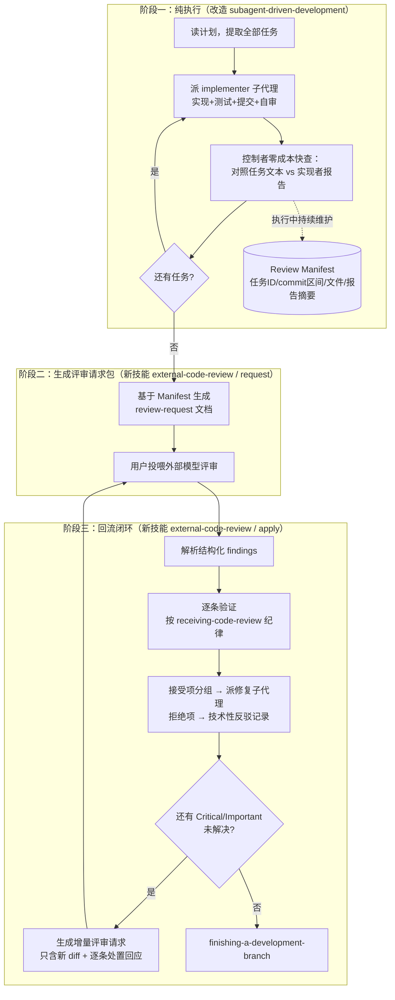

# 设计方案：执行/评审分离 + 外部评审闭环

> 目标：改造 superpowers 的执行阶段（`subagent-driven-development`），去掉每任务的实时双阶段评审；全部任务执行完成后统一生成 Code Review 提示词，交由**外部** Agent/模型执行评审；外部评审结果回流后，由当前 Claude 验证、修复并支持多轮迭代闭环。
>
> 本方案为 fork 本地改造。注意：仓库 CLAUDE.md 明确拒绝 fork-specific 改动的上游 PR，这些修改**不应提交到上游**。

---

## 1. 现状与目标的差距

### 1.1 现状（token 消耗的根源）

`subagent-driven-development` 的每任务循环：

```
implementer 子代理（实现+测试+提交+自审）
  → spec 合规评审子代理（读代码逐行对照需求）
    → 不合规：implementer 修 → spec 评审者复审（循环）
  → 代码质量评审子代理（读完整 diff，五维度评审）
    → 有问题：implementer 修 → 质量评审者复审（循环）
  → 标记完成
```

每任务**至少 3 次子代理派遣**；两个评审者各自完整读 diff/代码；发现问题还要追加"修→复审"轮次。N 个任务 ≈ 3N~5N 次子代理调用，其中约 2/3 的 token 花在评审上。

### 1.2 目标流程

```
阶段一（执行）：   每任务只派 implementer，不做任何实时评审
阶段二（出题）：   全部完成后，控制者生成一份自包含的评审请求包（提示词文档）
                  → 用户拿去调用外部 Agent/模型评审
阶段三（回流）：   外部评审结果交回 → 控制者验证每条 finding → 派修复子代理
                  → 生成增量评审请求（可选）→ 循环直到收敛 → finishing-a-development-branch
```

三条硬约束：

1. **职责分离**：评审不由当前 Claude 或其子代理执行——当前会话只"出题"和"改卷后修复"。
2. **提示词输出**：阶段二的产出是一份可直接投喂给任意外部模型的完整提示词文档。
3. **闭环**：外部评审结果作为标准化输入回流，驱动修复，支持多轮。

---

## 2. 新流程总览



---

## 3. 具体设计

### 3.1 改造 `subagent-driven-development`

**每任务循环缩减为：**

1. 派 implementer 子代理（`implementer-prompt.md` **不变**：保留开工前提问、四态协议 DONE/DONE_WITH_CONCERNS/NEEDS_CONTEXT/BLOCKED、自审、测试、逐任务 commit）。
2. 控制者做**零派遣快查**（新增，替代原 spec 评审的最低兜底）：只比对"任务文本 vs 实现者报告"，不读代码。发现明显缺项/多做才让 implementer 补，否则直接过。这一步几乎不花 token（两段文本都已在控制者上下文里）。
3. **追加 Manifest 条目**（见 3.2），标记任务完成，进入下一任务。

**删除**：每任务的 spec 合规评审派遣、代码质量评审派遣、以及"全部任务后派最终评审子代理"（由阶段二取代）。

**保留的质量底线**（去掉实时评审后防级联错误的机制）：

- 每任务测试必须通过才算 DONE（implementer 协议已有）；
- implementer 自审（已有，零额外成本）；
- 逐任务独立 commit（已有）——这是统一评审时能按任务切分 diff、按任务归因问题的前提，升级为 Red Flag 级硬要求；
- 计划本身的微步骤粒度 + writing-plans 的 No Placeholders 规则（上游已有，不动）。

**SKILL.md 需要同步修改的部分**：流程图（The Process）、Example Workflow、Red Flags（删除"跳过评审"类条目，新增"不得在执行阶段派遣任何评审子代理""每任务必须独立 commit"）、Integration（`requesting-code-review` 引用改为 `external-code-review`）。

`spec-reviewer-prompt.md` 与 `code-quality-reviewer-prompt.md` 两个文件**保留但退役**（不再被流程引用）；其评审标准文本合并进新的评审请求模板（3.3）。

### 3.2 Review Manifest（评审素材清单）

控制者在执行过程中**边执行边维护**的一个文件（不是靠事后回忆），路径：

```
docs/superpowers/reviews/YYYY-MM-DD-<feature>-manifest.md
```

每任务完成时追加一条：

```markdown
## Task 3: 增加校验函数
- Commits: a7981ec..3df7661
- Files: src/verify.ts, src/verify.test.ts
- 任务需求原文: <从计划中提取的该任务全文>
- 实现者报告摘要: <状态、实现内容、测试结果、自审发现、concerns>
```

为什么要落盘：阶段二生成评审请求时不依赖控制者上下文（长会话可能已被摘要压缩）；同时它就是评审请求包的原材料。

### 3.3 新技能 `external-code-review`

一个技能目录，两个入口（用参数或正文分节区分），对应阶段二和阶段三：

```
skills/external-code-review/
├── SKILL.md                      # 触发条件 + 两阶段流程
├── review-request-template.md    # 阶段二：评审请求包模板
└── fix-dispatcher-prompt.md      # 阶段三：修复子代理提示模板（implementer 变体）
```

#### 3.3.1 阶段二：生成评审请求包（request）

**产出物**：`docs/superpowers/reviews/YYYY-MM-DD-<feature>-review-request-r1.md`（r1 = 第一轮）

**模板结构**（内容合并原 spec-reviewer 与 code-quality-reviewer 的全部评审标准）：

```markdown
# Code Review Request: <feature> (Round 1)

## 你的角色
你是资深代码评审者。独立评审以下实现，不要信任实现者的自述——
以实际代码为准。（沿用原 "Do Not Trust the Report" 原则）

## 项目背景
<一段：项目是什么、本次改动目标、tech stack>

## 需求与计划
<spec 摘要 + 计划文件全文或关键内容>

## 变更内容
- 总范围: BASE_SHA..HEAD_SHA
- 按任务分解:（来自 Manifest）
  - Task 1: <需求原文> | commits X..Y | files ...
  - Task 2: ...

## Diff
<模式 E：按任务分块内嵌 git diff>
<模式 R：给出 SHA + git 命令，评审者自取>

## 评审维度
1. Spec 合规（逐任务）：缺失需求 / 多余实现 / 需求误解
2. 代码质量：关注分离、错误处理、类型安全、DRY、边界情况
3. 架构：设计合理性、与既有代码的集成、文件职责单一性
4. 测试：验证真实行为而非 mock、边界覆盖、TDD 痕迹
5. 跨任务一致性：命名/类型/签名在任务间是否一致（原每任务评审
   看不到的维度，统一评审反而是优势，明确要求检查）
6. 生产就绪：迁移、兼容性、明显 bug

## 输出格式（必须严格遵守，结果将被程序化解析）
<见 3.4>
```

**两种投喂模式**：

- **模式 R（默认，外部评审者有仓库访问）**：给出仓库路径、分支、SHA 区间与取 diff 的 git 命令，评审者自取代码，文档小。
- **模式 E（备选，外部评审者无仓库访问）**：内嵌完整 diff，按任务分块。若 diff 超过阈值（建议 ~3000 行），按任务拆成多个请求文件（r1-part1、r1-part2），每份都带完整背景章节。

默认按模式 R 生成；仅当用户说明评审者无仓库访问时用模式 E。

#### 3.3.2 外部评审结果的标准化输出格式

这是闭环可靠性的关键——写进评审请求包，**要求外部模型按此格式返回**：

```markdown
## Verdict
READY | READY_WITH_FIXES | NOT_READY

## Findings

### F1
- Severity: Critical | Important | Minor
- Task: <关联任务号，跨任务问题写 cross-cutting>
- Location: <file:line>
- Issue: <问题是什么>
- Why: <为什么重要>
- Fix: <建议修法，可选>

### F2
...

## Strengths
<做得好的地方，可选>
```

要点：每条 finding 有稳定 ID（F1/F2...），后续轮次的处置回应、增量请求都用 ID 引用；Severity 三级沿用原体系（Critical 必修 / Important 应修 / Minor 记录可不修）。

#### 3.3.3 阶段三：回流处理（apply）

**输入**：用户粘贴外部评审结果，或给出结果文件路径。

**流程**：

1. **解析**：按 3.3.2 格式提取 findings；格式不完全合规时尽力解析，无法定位的条目向用户澄清。
2. **逐条验证**：显式调用 `receiving-code-review` 纪律——对照代码库现实核实，不盲从、不表演性同意；每条得出处置：`ACCEPT` / `REJECT`（附技术理由）/ `NEED_CLARIFICATION`（问用户）。与人类伙伴既有决策冲突的先找用户。
3. **修复**：ACCEPT 的 findings 按涉及文件/任务分组，**派修复子代理**（`fix-dispatcher-prompt.md`，implementer 模板变体：输入为 finding 列表 + 相关任务上下文；同样要求测试通过、独立 commit、四态汇报）。控制者不亲手修（沿用"防上下文污染"原则）。
4. **生成处置报告 + 增量评审请求**（`...-review-request-r2.md`）：
   - 逐条 finding 的处置表（F1: FIXED @ commit / F3: REJECTED, 理由 / ...）；
   - 只含本轮修复的新 diff；
   - 请外部评审者确认修复 + 只审新改动。
5. **收敛条件**：所有 Critical 与 Important 均为 FIXED 或 REJECTED（用户认可反驳理由）→ 闭环结束，调用 `finishing-a-development-branch`。Minor 未修的记录在处置报告中。
6. **熔断**：同一 finding 修复 2 轮仍不过，停下与用户讨论（沿用 systematic-debugging 的"3 次失败质疑架构"精神）。

### 3.4 对既有技能的处理

| 技能 | 处理 |
|------|------|
| `subagent-driven-development` | **修改**（3.1） |
| `external-code-review` | **新建**（3.3） |
| `requesting-code-review` | **基本保留**：其他场景（ad-hoc 开发、卡住求视角）仍可用内部子代理评审；仅把"Mandatory: After each task in subagent-driven development"改为指向统一评审阶段 |
| `receiving-code-review` | **不改**：阶段三显式复用其验证纪律，它本来就是为"外部反馈"设计的 |
| `executing-plans` | **不改**：它本身没有每任务评审派遣；其收尾如需评审，可同样指向 `external-code-review` |
| `spec-reviewer-prompt.md` / `code-quality-reviewer-prompt.md` | 保留文件（供回退），流程不再引用；标准文本已并入 review-request-template |

---

## 4. 风险与缓解

| 风险 | 说明 | 缓解 |
|------|------|------|
| 级联错误 | 任务 N 建立在有缺陷的任务 N-1 上，统一评审时发现 N-1 的问题已波及多任务 | 每任务测试必须过 + 自审 + 控制者零派遣快查 + 计划微步骤粒度；修复阶段按 finding 分组派子代理，波及面由外部评审的 cross-cutting 维度显式暴露 |
| 大 diff 超出外部模型上下文 | 统一评审的 diff 是全量的 | 按任务分块；超阈值拆多份请求文件；模式 R 让有仓库访问的评审者自行分段取 |
| 外部结果格式漂移 | 不同模型对格式遵从度不同 | 请求包内嵌严格输出模板并声明"将被程序化解析"；回流时容错解析 + 澄清兜底 |
| 长会话上下文压缩丢失执行细节 | 阶段二可能发生在长会话尾部 | Manifest 边执行边落盘，阶段二只依赖文件不依赖记忆 |
| 上游更新冲突 | 本方案改动 `subagent-driven-development/SKILL.md` | 改动集中在 1 个修改文件 + 1 个新目录；git pull 冲突面小；新技能目录零冲突 |

## 5. 收益估算

- 原：每任务 3+ 次子代理派遣（1 实现 + 2 评审 + 修复循环），评审子代理各自完整读 diff。
- 新：每任务 1 次派遣；阶段二生成请求包只消耗控制者少量 token（素材来自 Manifest 与 git 元数据）；评审的推理成本整体转移到外部模型；阶段三只为被接受的 findings 派修复子代理。
- 粗估执行阶段子代理调用次数降为原来的 1/3 左右，评审 token 成本外移 100%。

## 6. 决策记录（2026-07-19 已确认）

1. **外部评审者有仓库访问** → 默认模式 R（模式 E 保留为备选）。
2. **控制者零派遣快查：保留**。
3. **`requesting-code-review` 的 mandatory 触发点：微调**，指向 external-code-review。

## 7. 实施顺序

1. 新建 `skills/external-code-review/`（SKILL.md + 两个模板）——纯新增，无风险。
2. 修改 `skills/subagent-driven-development/SKILL.md`（流程图、示例、Red Flags、Integration）。
3. 微调 `skills/requesting-code-review/SKILL.md` 触发点（如决策点 3 同意）。
4. 用一个真实小型计划跑一轮端到端验证：执行 → 生成请求包 → 你投喂外部模型 → 结果回流 → 修复 → 增量请求。
