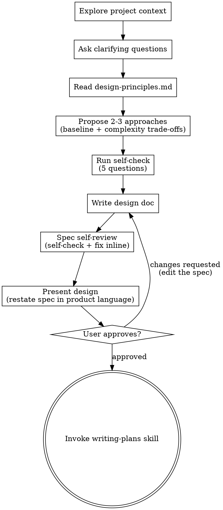

# Brainstorming Ideas Into Designs

Help turn ideas into fully formed designs and specs through natural collaborative dialogue.

Start by understanding the current project context, then ask questions one at a time to refine the idea. Once you understand what you're building, write the spec, then present that spec back in the reviewer's language and get user approval.

<HARD-GATE>
Do NOT invoke any implementation skill, write any code, scaffold any project, or take any implementation action until you have presented a design and the user has approved it. This applies to EVERY project regardless of perceived simplicity.
</HARD-GATE>

## Anti-Pattern: "This Is Too Simple To Need A Design"

Every project goes through this process. A todo list, a single-function utility, a config change — all of them. "Simple" projects are where unexamined assumptions cause the most wasted work. The design can be short (a few sentences for truly simple projects), but you MUST present it and get approval.

## Checklist

You MUST create a task for each of these items and complete them in order:

1. **Explore project context** — check files, docs, recent commits
2. **Offer the visual companion just-in-time** — NOT upfront. The first time a question would genuinely be clearer shown than described, offer it then (its own message); on approval its browser tab opens for you. If no visual question ever arises, never offer it. See the Visual Companion section below.
3. **Ask clarifying questions** — one at a time, understand purpose/constraints/success criteria
4. **Read the design principles** — read `skills/brainstorming/design-principles.md` in full. This is a gate, not a suggestion (see below)
5. **Propose 2-3 approaches** — baseline first, with complexity as an explicit trade-off axis and your recommendation
6. **Run the self-check** — five questions below; fix what they expose before writing the spec
7. **Write design doc** — save to `docs/superpowers/specs/YYYY-MM-DD-<topic>-design.md` and commit
8. **Spec self-review** — re-run the self-check against the written spec, plus placeholders, contradictions, ambiguity, scope (see below)
9. **Present design** — restate the written spec in pure product language, following `skills/brainstorming/design-presentation.md`. This is a gate, not a suggestion (see below)
10. **User approves** — offer the quick prototype with the approval ask (see below). Approval covers the presentation and the spec; changes go into the spec, then re-present
11. **Transition to implementation** — invoke writing-plans skill to create implementation plan

<HARD-GATE>
Do NOT propose approaches or present a design until you have read `skills/brainstorming/design-principles.md` in this session. Reading it is step 4 of the checklist and it has no substitute — you do not already know what it says, and summarizing it from memory is how the principles stop being applied. Every approach you propose and every design section you present is judged against it.
</HARD-GATE>

<HARD-GATE>
Do NOT present the design before the spec is written and self-reviewed, and do NOT present it without reading `skills/brainstorming/design-presentation.md` in this session. The presentation is a restatement of the written spec in the reviewer's language — there is nothing to restate until the spec exists. Presenting from your head instead of from the spec is how the two drift apart.
</HARD-GATE>

## Process Flow

**The terminal state is invoking writing-plans.** Do NOT invoke frontend-design, mcp-builder, or any other implementation skill. The ONLY skill you invoke after brainstorming is writing-plans.

## The Process

**Understanding the idea:**

- Check out the current project state first (files, docs, recent commits)
- Before asking detailed questions, assess scope: if the request describes multiple independent subsystems (e.g., "build a platform with chat, file storage, billing, and analytics"), flag this immediately. Don't spend questions refining details of a project that needs to be decomposed first.
- If the project is too large for a single spec, help the user decompose into sub-projects: what are the independent pieces, how do they relate, what order should they be built? Then brainstorm the first sub-project through the normal design flow. Each sub-project gets its own spec → plan → implementation cycle.
- For appropriately-scoped projects, ask questions one at a time to refine the idea
- Prefer multiple choice questions when possible, but open-ended is fine too
- Only one question per message - if a topic needs more exploration, break it into multiple questions
- Focus on understanding: purpose, constraints, success criteria

**Exploring approaches:**

Read `skills/brainstorming/design-principles.md` first. Then:

- Propose 2-3 different approaches with trade-offs — and make **complexity one of the trade-off axes**, stated explicitly rather than left implied
- **One option MUST be the baseline**: the simplest approach that meets the stated need. If you are not recommending it, say precisely what it fails to handle — "it doesn't scale" is not an answer, "it re-reads the whole file on every keystroke and the files are already 40MB" is
- For every option above the baseline, name the specific complexity it adds, which of the justifying reasons it draws on, and the evidence for that reason. Complexity with no reason from that list is speculation — drop it from the proposal rather than offering it
- Spell out cost and benefit concretely: what it costs to build, to understand, to operate, and to change later; what it buys, and for whom
- Present options conversationally with your recommendation and reasoning
- Lead with your recommended option and explain why

Good trade-off statement:

> **B — add a job queue.** Buys: uploads stop blocking the request. Costs: a second process to run and monitor, plus retry/duplicate semantics to get right. Justified by: scale already in sight — p95 upload is 8s today and growing.

Bad trade-off statement:

> **B — add a job queue.** More scalable and future-proof, slightly more complex.

The second one skips for whom, why, what it costs, and what evidence backs it.

**Self-check:**

Run these against the design before you write the spec, and again against the written spec. If an answer is uncomfortable, the design is telling you something — fix it rather than explaining it away.

- **Can you explain it?** Could you explain how this works to a new colleague in three sentences?
- **Will they guess right?** The first time a user touches it, does their intuition match the actual behavior?
- **Is failure visible?** When something goes wrong, can you quickly tell which piece broke and how far the damage reaches?
- **Complex for whom?** Every extra abstraction or process step — does it serve a need that has already occurred, or one you are imagining?
- **Where did the complexity go?** Did this simplification actually remove complexity, or just push it onto users or operations?

**Design for isolation and clarity:**

- Break the system into smaller units that each have one clear purpose, communicate through well-defined interfaces, and can be understood and tested independently
- For each unit, you should be able to answer: what does it do, how do you use it, and what does it depend on?
- Can someone understand what a unit does without reading its internals? Can you change the internals without breaking consumers? If not, the boundaries need work.
- Smaller, well-bounded units are also easier for you to work with - you reason better about code you can hold in context at once, and your edits are more reliable when files are focused. When a file grows large, that's often a signal that it's doing too much.

**Working in existing codebases:**

- Explore the current structure before proposing changes. Follow existing patterns.
- Where existing code has problems that affect the work (e.g., a file that's grown too large, unclear boundaries, tangled responsibilities), include targeted improvements as part of the design - the way a good developer improves code they're working in.
- Don't propose unrelated refactoring. Stay focused on what serves the current goal.

## After the Design

**Documentation:**

- Write the validated design (spec) to `docs/superpowers/specs/YYYY-MM-DD-<topic>-design.md`
  - (User preferences for spec location override this default)
- Include a **Complexity Decisions** section: one line per piece of complexity accepted over the baseline — what was added, for whom, the justifying reason and its evidence, what it costs, what it buys. Also record what you deliberately left out and what evidence would change that answer. Without this, the reasoning is gone by the time anyone implements it
- Cover: architecture, components, data flow, error handling, testing. **The spec is written to be implemented from** — it carries the detail an implementer needs, not the framing a reviewer needs. The reviewer-facing framing goes in the presentation (next step) and stays out of the spec
- Use elements-of-style:writing-clearly-and-concisely skill if available
- Commit the design document to git

**Spec Self-Review:**
After writing the spec document, look at it with fresh eyes:

1. **Placeholder scan:** Any "TBD", "TODO", incomplete sections, or vague requirements? Fix them.
2. **Internal consistency:** Do any sections contradict each other? Does the architecture match the feature descriptions?
3. **Scope check:** Is this focused enough for a single implementation plan, or does it need decomposition?
4. **Ambiguity check:** Could any requirement be interpreted two different ways? If so, pick one and make it explicit.
5. **Self-check:** Re-run all five self-check questions against the written spec — explainable in three sentences, behavior matches intuition, failures are locatable, every abstraction serves a need that already occurred, and complexity was removed rather than pushed onto users or ops.
6. **Complexity ledger check:** Does every piece of complexity in the spec appear in the Complexity Decisions section with a justifying reason and its evidence? Anything that doesn't is either unjustified — cut it — or under-documented — write the line.

Fix any issues inline. No need to re-review — just fix and move on.

**Presenting the design:**

Only now, with the spec written and self-reviewed, do you present the design to the user.

Read `skills/brainstorming/design-presentation.md` and follow it. In short: **restate the written spec in pure product language** — what people do and what the system records, with no file, class, table, or framework names — covering four parts:

1. **Approach summary** — the core idea in a few sentences, the key changes plus the whole surrounding flow threaded by one concrete example (at each step: what the person does, what the system records), and the key branch flows
2. **Design rationale** — the new concepts and what each maps to in the real world, the single most central decision and what you rejected, the relationship to concepts already in the system, the assumptions and constraints, and the scenarios this cannot cover
3. **Implementation approach** — the five most important rules, which existing modules and flows are touched, and whether the new logic lands in one place or many
4. **Change inventory** — pages, interaction steps, fields and entity changes, plus one concrete example of the effect after the change

**None of this gets written into the spec.** It is what a reviewer needs in order to judge the approach; the spec is what an implementer needs in order to build it.

**User Approval Gate:**
After presenting, point the user at the spec path and ask for approval. If the design touches pages or interactions, offer the quick prototype in the same message:

> "Spec written and committed to `<path>`, and the approach is laid out above. Want me to spin up a quick prototype so you can see the pages before approving? Either way, let me know if you want to change anything before we start writing out the implementation plan."

If they want the prototype, dispatch **one subagent** on a fast execution-oriented model (Grok 4.6 High Fast, DeepSeek V4.1 Flash, or Sonnet 5 — whatever your harness offers) using the prompt in `design-presentation.md`. The subagent starts cold, so the prompt must carry the spec path and the design rationale from the presentation. Don't build the prototype yourself in this session — it is throwaway visualization, not implementation.

Wait for the user's response. If they request changes, **make the changes in the spec** — not in the prototype — re-run the spec self-review, and present again. Only proceed once the user approves.

**Implementation:**

- Invoke the writing-plans skill to create a detailed implementation plan
- Do NOT invoke any other skill. writing-plans is the next step.

## Key Principles

- **One question at a time** - Don't overwhelm with multiple questions
- **Multiple choice preferred** - Easier to answer than open-ended when possible
- **YAGNI ruthlessly** - Remove unnecessary features from all designs
- **Simplest-that-works is the baseline** - Every added piece of complexity must say for whom, why, what it costs, what it buys. Can't say it? Don't add it. See `design-principles.md`
- **Explore alternatives** - Always propose 2-3 approaches before settling
- **Incremental validation** - Get approval on the presented design before moving to implementation
- **Two readers, two documents** - The spec is written to be implemented from; the presentation is written to be reviewed from. Never let the presentation say something the spec doesn't
- **Be flexible** - Go back and clarify when something doesn't make sense

## Visual Companion

A browser-based companion for showing mockups, diagrams, and visual options during brainstorming. Available as a tool — not a mode. Accepting the companion means it's available for questions that benefit from visual treatment; it does NOT mean every question goes through the browser.

**Offering the companion (just-in-time):** Do NOT offer it upfront. Wait until a question would genuinely be clearer shown than told — a real mockup / layout / diagram question, not merely a UI *topic*. The first time that happens, offer it then, as its own message:
> "This next part might be easier if I show you — I can put together mockups, diagrams, and comparisons in a browser tab as we go. It's still new and can be token-intensive. Want me to? I'll open it for you."

**This offer MUST be its own message.** Only the offer — no clarifying question, summary, or other content. Wait for the user's response. If they accept, start the server with `--open` so their browser opens to the first screen automatically. If they decline, continue text-only and don't offer again unless they raise it.

**Per-question decision:** Even after the user accepts, decide FOR EACH QUESTION whether to use the browser or the terminal. The test: **would the user understand this better by seeing it than reading it?**

- **Use the browser** for content that IS visual — mockups, wireframes, layout comparisons, architecture diagrams, side-by-side visual designs
- **Use the terminal** for content that is text — requirements questions, conceptual choices, tradeoff lists, A/B/C/D text options, scope decisions

A question about a UI topic is not automatically a visual question. "What does personality mean in this context?" is a conceptual question — use the terminal. "Which wizard layout works better?" is a visual question — use the browser.

If they agree to the companion, read the detailed guide before proceeding:
`skills/brainstorming/visual-companion.md`
