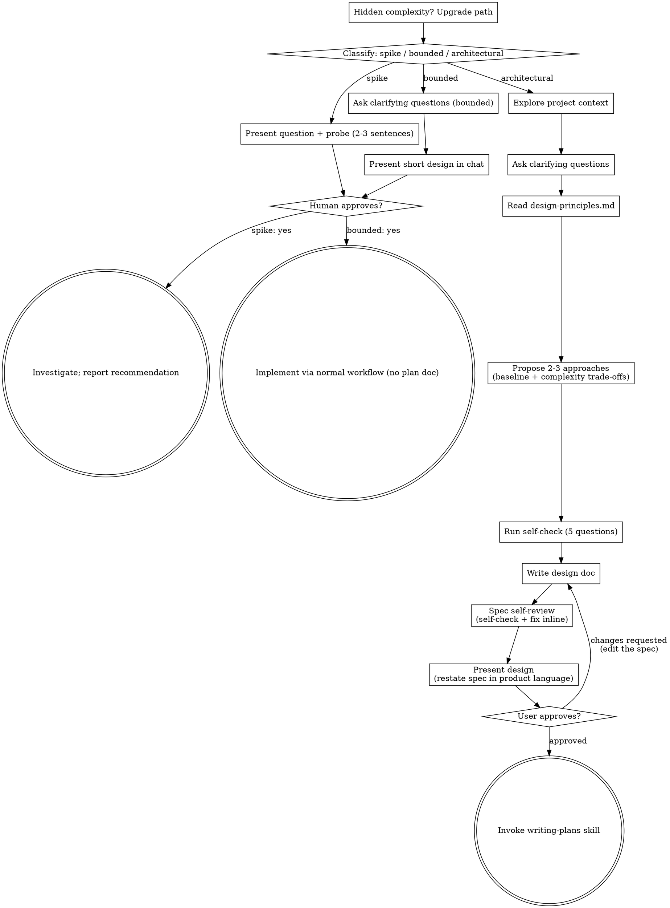

# Brainstorming Ideas Into Designs

Help turn ideas into fully formed designs and specs through natural collaborative dialogue.

Start by classifying how much process the request needs, then work
through your path: understand the context, refine the idea, present a
design, and get your human partner's approval.

## Establish Shared Understanding

The outcome of brainstorming is an understanding your human partner can
recognize and correct, grounded in what they want to accomplish.

1. **Discover intent.** Use the request and available context to identify
   the intended outcome, who it is for, and what success looks like. When
   that information is missing, ask one focused question about purpose or
   intended use before proposing features or an approach. Knowing the app
   genre does not tell you why your partner wants it. Gathering missing
   requirements does not ask them to authorize the task again.
2. **Write back your understanding.** Summarize the intended outcome,
   relevant constraints, and success criteria in a short note your partner
   can assess. Separate what they said from assumptions. Invite correction
   and incorporate their answer before treating this as the design brief.
3. **Carry intent into the design.** Preserve the agreed understanding in
   the selected path's design artifact: the written spec for architectural
   work, or the in-chat design/probe for bounded work and spikes. Check
   proposed features and technical choices against that understanding.

When the request already supplies the purpose and constraints, reflect
that understanding instead of asking the same questions again. Keep the
note concise; its accuracy and the opportunity to correct it matter.

<HARD-GATE>
Before taking any implementation action, including invoking an
implementation skill, writing product code, scaffolding, installing
product dependencies, or creating an external project, complete the
selected path's prerequisites:

- Spike: the human partner approves the question and probe.
- Bounded: the human partner approves the short in-chat design.
- Architectural: the human partner approves the design as presented back
  from the written spec, then reviews the written implementation plan and
  selects its execution method. Approval of an approach in conversation
  only permits writing the spec; approval of the presented spec only
  permits invoking writing-plans.

A reply approves the stage actually presented. Approval of an idea or
feature scope does not approve artifacts that do not exist yet. Resume
at the earliest incomplete stage; do not turn one approval into permission
to skip the rest of the selected path. Read-only project exploration is
allowed while those prerequisites remain incomplete.
</HARD-GATE>

## Three Paths

Before your first question, classify the request and say the
classification out loud — "this looks bounded, so I'll present a short
design here rather than write a spec" — so your human partner can
override it:

- **Spike** — a feasibility question ("can we...", "is it possible...",
  "quick and dirty is fine") whose output is an answer, not code you
  keep. Present the question and what you'll try in 2-3 sentences, get
  a nod, then find out as cheaply as correctness allows. No design
  doc, no spec file. Report findings as a recommendation; anything you
  built stays labeled throwaway.
- **Bounded** — a well-scoped change to code that already exists in
  this repo: a new flag, a small endpoint, a one-file fix.
  Understanding the kind of app is not enough — bounded means the flow
  you are changing is already here to read. If there is no existing
  flow to change, the task is not bounded. Ask the clarifying
  questions that matter, present a short design IN CHAT (a few
  sentences to a few short paragraphs), and STOP. Implementation
  starts only after your human partner says yes to that design — a
  bounded task's approval is as hard a gate as an architectural
  one. No spec file, no implementation plan document.
- **Architectural** — new projects, new subsystems, changes that
  restructure how components fit together or alter interfaces others
  depend on. Follow the full process: questions, approaches, sectioned
  design, written spec, then the writing-plans skill.

When in doubt between two paths, take the heavier one. The ratchet is
one-way: hidden complexity discovered mid-task upgrades the path —
stop, say so, and step up. Nothing downgrades mid-task.

## Anti-Pattern: "Too Simple To Need Approval"

Every path ends with your human partner approving the required design
before implementation. A bounded change may need only two sentences in
chat. A new todo-list project is architectural and requires the written
spec and planning handoffs. Scale the artifact to the selected path;
complete that path's reviews before implementation.

## Red Flags

| Thought | Reality |
|---------|---------|
| "This is too simple to need a design" | Follow the selected path: a bounded change gets a short chat design; an architectural change gets the written spec and planning handoffs. |
| "I'll call it bounded and skip the spec" | Reaching for a label to skip work IS the doubt — take the heavier path. |
| "It's bounded and the design is obvious — I'll start while they read it" | The gate is the approval, not the design's length. Present, then stop until you hear yes. |
| "I understand this kind of app, so it's bounded" | Bounded measures the repo, not your familiarity. A new project has no existing flow — it is architectural. |
| "The spike works, so I'll keep the code" | A spike's output is an answer. Keeping the code is a new request — classify it. |
| "It grew, but I'm almost done — no need to re-classify" | Hidden complexity upgrades the path mid-task. Stop and say so. |
| "They approved the spike, so the follow-up change is approved too" | Each task gets its own classification and its own approval. |
| "I know what good design looks like — I don't need to open design-principles.md" | You are about to judge every approach against it. Read the file; a remembered gist is how the baseline option quietly disappears. |
| "The design is in my head, I'll present it and write the spec after" | Architectural presentation is a restatement of the written spec. Write the spec first, or the two drift the moment they differ. |
| "This framing is good, I'll put it in the spec too" | The spec is what an implementer builds from. Reviewer framing bloats it — present it, don't file it. |

## Checklist

Classify first, announce the path, then create a task for each item on
your path and complete them in order.

**Spike:**
1. **Explore project context** — enough to frame the probe
2. **Present question + probe plan** — 2-3 sentences
3. **Get approval** — a nod is enough
4. **Investigate** — as cheaply as correctness allows
5. **Report findings** — a recommendation; label anything built as throwaway

**Bounded:**
1. **Explore project context** — check files, docs, recent commits
2. **Ask clarifying questions** — one at a time, the ones that matter
3. **Present short design in chat** — approach, files touched, testing
4. **Get approval** — STOP and wait for an explicit yes; presenting the design and starting in the same breath is skipping the gate
5. **Implement** — proceed with the normal development workflow (TDD applies); no plan document

**Architectural:**
1. **Explore project context** — check files, docs, recent commits
2. **Offer the visual companion just-in-time** — NOT upfront. The first time a question would genuinely be clearer shown than described, offer it then (its own message); on approval its browser tab opens for you. If no visual question ever arises, never offer it. See the Visual Companion section below.
3. **Ask clarifying questions** — one at a time, understand purpose/constraints/success criteria
4. **Read the design principles** — read [design-principles.md](design-principles.md) in full
5. **Propose 2-3 approaches** — baseline first, with complexity as an explicit trade-off axis and your recommendation
6. **Run the self-check** — five questions below; fix what they expose before writing the spec
7. **Write design doc** — save to `docs/superpowers/specs/YYYY-MM-DD-<topic>-design.md` and commit
8. **Spec self-review** — re-run the self-check against the written spec, plus placeholders, contradictions, ambiguity, scope (see below)
9. **Present design** — restate the written spec in pure product language, following [design-presentation.md](design-presentation.md)
10. **User approves** — offer the quick prototype with the approval ask. Approval covers the presentation and the spec; changes go into the spec, then re-present
11. **Transition to implementation** — invoke writing-plans skill to create implementation plan

<HARD-GATE>
Architectural path only. Do NOT propose approaches until you have read
[design-principles.md](design-principles.md) in this session, and do NOT
present the design until the spec is written, self-reviewed, and you have
read [design-presentation.md](design-presentation.md). Summarizing either
file from memory does not count — that is how the principles stop being
applied and how the presentation drifts from the spec. Every approach you
propose is judged against the principles; the presentation is a restatement
of the written spec, so there is nothing to restate until the spec exists.
</HARD-GATE>

## Process Flow

**Terminal states are path-bound.** Architectural: the ONLY skill you
invoke after brainstorming is writing-plans — never frontend-design,
mcp-builder, or any other implementation skill. Bounded: after
approval, implementation proceeds directly through the normal
development workflow; no plan document. Spike: the terminal state is a
reported recommendation.

## The Process

The subsections below serve the bounded and architectural paths (a
spike stops at "present the probe, get a nod"). Sections from
**Exploring approaches** onward are architectural-path depth — for
bounded work, context plus a few questions plus a short in-chat design
is the whole process.

**Understanding the idea:**

- Check out the current project state first (files, docs, recent commits)
- Before asking detailed questions, assess scope: if the request describes multiple independent subsystems (e.g., "build a platform with chat, file storage, billing, and analytics"), flag this immediately. Don't spend questions refining details of a project that needs to be decomposed first.
- If the project is too large for a single spec, help the user decompose into sub-projects: what are the independent pieces, how do they relate, what order should they be built? Then brainstorm the first sub-project through the normal design flow. Each sub-project gets its own spec → plan → implementation cycle.
- For appropriately-scoped projects, ask questions one at a time to refine the idea
- Prefer multiple choice questions when possible, but open-ended is fine too
- Only one question per message - if a topic needs more exploration, break it into multiple questions
- Focus on understanding: purpose, constraints, success criteria

**Exploring approaches:**

Read [design-principles.md](design-principles.md) first. Then:

- Propose 2-3 different approaches with trade-offs — and make **complexity one of the trade-off axes**, stated explicitly rather than left implied
- **One option MUST be the baseline**: the simplest approach that meets the stated need. If you are not recommending it, say precisely what it fails to handle — "it doesn't scale" is not an answer, "it re-reads the whole file on every keystroke and the files are already 40MB" is
- For every option above the baseline, name the specific complexity it adds, which of the justifying reasons it draws on, and the evidence for that reason. Complexity with no reason from that list is speculation — drop it from the proposal rather than offering it
- Spell out cost and benefit concretely: what it costs to build, to understand, to operate, and to change later; what it buys, and for whom
- Present options conversationally with your recommendation and reasoning
- Lead with your recommended option and explain why
- YAGNI ruthlessly - remove unnecessary features from every approach and design

Good trade-off statement:

> **B — add a job queue.** Buys: uploads stop blocking the request. Costs: a second process to run and monitor, plus retry/duplicate semantics to get right. Justified by: scale already in sight — p95 upload is 8s today and growing.

Bad trade-off statement:

> **B — add a job queue.** More scalable and future-proof, slightly more complex.

The second one skips for whom, why, what it costs, and what evidence backs it.

**Self-check:**

Run these against the design before you write the spec, and again against the written spec. If an answer is uncomfortable, the design is telling you something — fix it rather than explaining it away.

- **Can you explain it?** Could you explain how this works to a new colleague in three sentences?
- **Will they guess right?** The first time a user touches it, does their intuition match the actual behavior?
- **Is failure visible?** When something goes wrong, can you quickly tell which piece broke and how far the damage reaches?
- **Complex for whom?** Every extra abstraction or process step — does it serve a need that has already occurred, or one you are imagining?
- **Where did the complexity go?** Did this simplification actually remove complexity, or just push it onto users or operations?

**Design for isolation and clarity:**

- Break the system into smaller units that each have one clear purpose, communicate through well-defined interfaces, and can be understood and tested independently
- For each unit, you should be able to answer: what does it do, how do you use it, and what does it depend on?
- Can someone understand what a unit does without reading its internals? Can you change the internals without breaking consumers? If not, the boundaries need work.
- Smaller, well-bounded units are also easier for you to work with - you reason better about code you can hold in context at once, and your edits are more reliable when files are focused. When a file grows large, that's often a signal that it's doing too much.

**Working in existing codebases:**

- Explore the current structure before proposing changes. Follow existing patterns.
- Where existing code has problems that affect the work (e.g., a file that's grown too large, unclear boundaries, tangled responsibilities), include targeted improvements as part of the design - the way a good developer improves code they're working in.
- Don't propose unrelated refactoring. Stay focused on what serves the current goal.

## After the Design (architectural path)

**Documentation:**

- Write the validated design (spec) to `docs/superpowers/specs/YYYY-MM-DD-<topic>-design.md`
  - (User preferences for spec location override this default)
- Cover: architecture, components, data flow, error handling, testing. Scale each section to its complexity: a few sentences if straightforward, up to 200-300 words if nuanced. **The spec is written to be implemented from** — it carries the detail an implementer needs, not the framing a reviewer needs; that framing goes in the presentation and stays out of the spec
- Include a **Complexity Decisions** section: one line per piece of complexity accepted over the baseline — what was added, for whom, the justifying reason and its evidence, what it costs, what it buys. Also record what you deliberately left out and what evidence would change that answer. Without this, the reasoning is gone by the time anyone implements it
- Use elements-of-style:writing-clearly-and-concisely skill if available
- Commit the design document to git

**Spec Self-Review:**
After writing the spec document, look at it with fresh eyes:

1. **Placeholder scan:** Any "TBD", "TODO", incomplete sections, or vague requirements? Fix them.
2. **Internal consistency:** Do any sections contradict each other? Does the architecture match the feature descriptions?
3. **Scope check:** Is this focused enough for a single implementation plan, or does it need decomposition?
4. **Ambiguity check:** Could any requirement be interpreted two different ways? If so, pick one and make it explicit.
5. **Self-check:** Re-run all five self-check questions against the written spec — explainable in three sentences, behavior matches intuition, failures are locatable, every abstraction serves a need that already occurred, and complexity was removed rather than pushed onto users or ops.
6. **Complexity ledger check:** Does every piece of complexity in the spec appear in the Complexity Decisions section with a justifying reason and its evidence? Anything that doesn't is either unjustified — cut it — or under-documented — write the line.

Fix any issues inline. No need to re-review — just fix and move on.

**Presenting the design:**

Only now, with the spec written and self-reviewed, do you present the design.

Read [design-presentation.md](design-presentation.md) and follow it. In short: **restate the written spec in pure product language** — what people do and what the system records, with no file, class, table, or framework names — covering four parts:

1. **Approach summary** — the core idea in a few sentences, the key changes plus the whole surrounding flow threaded by one concrete example (at each step: what the person does, what the system records), and the key branch flows
2. **Design rationale** — the new concepts and what each maps to in the real world, the single most central decision and what you rejected, the relationship to concepts already in the system, the assumptions and constraints, and the scenarios this cannot cover
3. **Implementation approach** — the five most important rules, which existing modules and flows are touched, and whether the new logic lands in one place or many
4. **Change inventory** — pages, interaction steps, fields and entity changes, plus one concrete example of the effect after the change

**None of this gets written into the spec.** It is what a reviewer needs in order to judge the approach; the spec is what an implementer needs in order to build it. Never let the presentation say something the spec does not.

**User Approval Gate:**
After presenting, point the user at the spec path and ask for approval. If the design touches pages or interactions, offer the quick prototype in the same message:

> "Spec written and committed to `<path>`, and the approach is laid out above. Want me to spin up a quick prototype so you can see the pages before approving? Either way, let me know if you want to change anything before we start writing out the implementation plan."

If they want the prototype, dispatch **one subagent** on a fast execution-oriented model using the prompt in [design-presentation.md](design-presentation.md). The subagent starts cold, so the prompt must carry the spec path and the design rationale from the presentation. Don't build the prototype yourself in this session — it is throwaway visualization, not implementation.

Wait for the user's response. If they request changes, **make the changes in the spec** — not in the prototype — re-run the spec review loop, and present again. Only proceed once the user approves.

**Implementation:**

- Invoke the writing-plans skill to create a detailed implementation plan
- Do NOT invoke any other skill. writing-plans is the next step.

## Visual Companion

A browser-based companion for showing mockups, diagrams, and visual options during brainstorming. Available as a tool — not a mode. Accepting the companion means it's available for questions that benefit from visual treatment; it does NOT mean every question goes through the browser.

**Offering the companion (just-in-time):** Do NOT offer it upfront. Wait until a question would genuinely be clearer shown than told — a real mockup / layout / diagram question, not merely a UI *topic*. The first time that happens, offer it then, as its own message:
> "This next part might be easier if I show you — I can put together mockups, diagrams, and comparisons in a browser tab as we go. It's still new and can be token-intensive. Want me to? I'll open it for you."

**This offer MUST be its own message.** Only the offer — no clarifying question, summary, or other content. Wait for the user's response. If they accept, start the server with `--open` so their browser opens to the first screen automatically. If they decline, continue text-only and don't offer again unless they raise it.

**Per-question decision:** Even after the user accepts, decide FOR EACH QUESTION whether to use the browser or the terminal. The test: **would the user understand this better by seeing it than reading it?**

- **Use the browser** for content that IS visual — mockups, wireframes, layout comparisons, architecture diagrams, side-by-side visual designs
- **Use the terminal** for content that is text — requirements questions, conceptual choices, tradeoff lists, A/B/C/D text options, scope decisions

A question about a UI topic is not automatically a visual question. "What does personality mean in this context?" is a conceptual question — use the terminal. "Which wizard layout works better?" is a visual question — use the browser.

If they agree to the companion, read the detailed guide before proceeding:
`skills/brainstorming/visual-companion.md`
