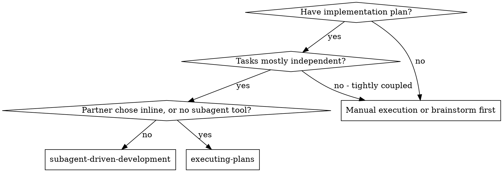
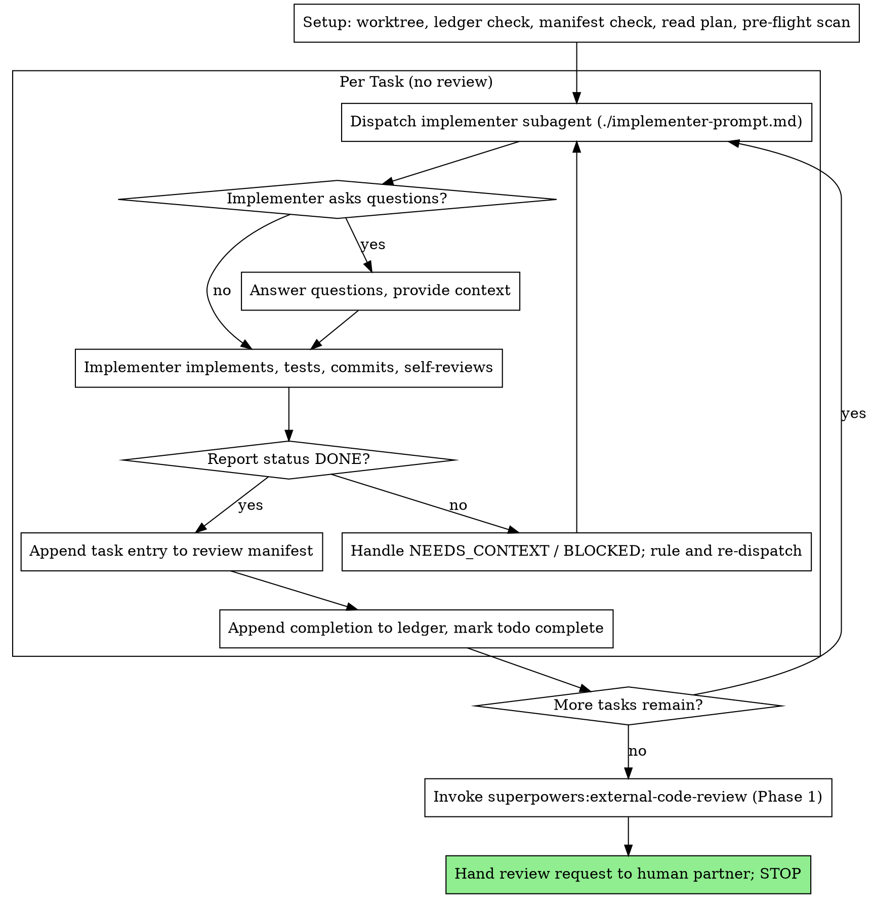

# Subagent-Driven Development

Execute plan by dispatching a fresh implementer subagent per task, with NO review during execution. When every task is done, hand one unified review request to an external agent or model outside this session.

**Why subagents:** You delegate tasks to specialized agents with isolated context. By precisely crafting their instructions and context, you ensure they stay focused and succeed at their task. They should never inherit your session's context or history — you construct exactly what they need. This also preserves your own context for coordination work.

**Core principle:** Fresh subagent per task + zero review during execution + one unified external review at the end = fast iteration, one high-quality review seat instead of N mediocre ones

**Zero review during execution.** You do not review task diffs, and you do
not dispatch reviewer subagents — not per task, not at the end. The review
seat belongs to an external model your human partner runs. What you owe the
review is a **manifest**: an accurate record, written as you go, of what each
task changed and what evidence backs it. Execution's job is to produce
correct commits and an honest manifest; judging them is someone else's job.

**Narration:** between tool calls, narrate at most one short line — the
ledger and the tool results carry the record.

**Continuous execution:** Do not pause to check in with your human partner between tasks. Execute all tasks from the plan without stopping. The only reasons to stop are the four named below, or all tasks complete. "Should I continue?" prompts and progress summaries waste their time — they asked you to execute the plan, so execute it.

**Rulings, not stalls.** A running plan does not wait on a human. Conflicts,
ambiguities, plan defects, a judgment call you would have asked about —
decide them. The spec is the binding authority, the plan is its argument, and your
judgment settles what neither answers. Record every decision in the ledger as
`Ruling: <what you decided> — <why> — <what it costs if wrong>`, and keep
going. A wrong ruling costs rework your human partner can see and undo; a
session parked on a question costs their whole day and buys nothing.

Four things stop you, and only these: an irreversible or destructive
operation; a security-sensitive action; a side effect outside this worktree
that norms say you ask about first (a merge, a push to a shared branch, a
publish); and a plan so broken that every path forward is a guess. For those,
stop and ask.

Freeing a port a service needs is none of those — kill what holds it and
restart. A verification skipped over a busy port is a verification that did
not happen.

## When to Use



**vs. Executing Plans (inline):**
- Fresh subagent per task (no context pollution) instead of one context doing every task
- **Review is external.** This skill dispatches no reviewer at all: the whole
  branch goes to an agent or model outside the session via
  superpowers:external-code-review. Inline execution keeps its review in
  the session — one fresh reviewer subagent over the whole branch at the end
- Costs a fresh context per task and zero review seats here; inline costs one
  context plus one in-session final reviewer
- Choose this skill when the review should come from a model this session
  cannot dispatch — a stronger model, a different vendor, or a human
  reviewing out of band. Choose executing-plans when an in-session reviewer
  is good enough and you want the cheapest path
- Both run in this session, share the same plan workspace and ledger, and never pause between tasks

## The Process



## Setup

Ensure the work happens in an isolated workspace: use
superpowers:using-git-worktrees to create one or verify the existing one.
Never start implementation on a main/master branch without your human
partner's explicit consent.

Conversation memory does not survive compaction. In real sessions,
controllers that lost their place have re-dispatched entire completed task
sequences — the single most expensive failure observed. Track progress in
a ledger file, not only in todos.

- Each plan owns a workspace: at skill start, run this skill's
  `bash scripts/sdd-workspace PLAN_FILE` — it prints the plan's git-ignored
  directory (under `<repo-root>/.superpowers/sdd/`), home to
  every artifact for THIS plan: ledger, briefs, reports, review packages.
  Another plan's directory is never yours to read or write.
- Check for this plan's ledger at `<workspace>/progress.md`. If its first
  line names your plan file, tasks with a `Task <N>: complete` line are DONE
  — do not re-dispatch them; resume at the first task without one. A task
  with a dispatch line but no completion line was interrupted mid-task:
  check `git log` and the manifest before re-dispatching, so you neither
  redo finished work nor leave it out of the manifest. A ledger whose first
  line names a different plan file — or a stray
  ledger at the old flat path `.superpowers/sdd/progress.md` — is another
  plan's progress: leave it in place and start your own, fresh.
- Create the ledger with its identity as the first line:
  `# SDD ledger — plan: <plan file path>`.
- **The review manifest lives outside the workspace**, at
  `docs/superpowers/reviews/YYYY-MM-DD-<feature>-manifest.md`, and is
  committed. The workspace is git-ignored scratch that gets deleted; the
  manifest has to outlive it, because the external review is built from it
  after execution ends. Create it at setup with the plan path, the spec
  path, and the branch's merge base, then append one entry per task as you
  go. Never reconstruct it from memory at the end — a manifest written from
  recollection is the failure this skill exists to avoid.
- The ledger is your recovery map: the commits it names exist in git even
  when your context no longer remembers creating them. After compaction,
  trust the ledger and `git log` over your own recollection.
- `git clean -fdx` will destroy the workspace (it's git-ignored scratch); if
  that happens, recover from `git log`.

Read the plan once, note its context and Global Constraints, and create a
todo per task. If the plan names a Spec, read that too: the spec is the
authority the plan argues from, and conflicts inside the plan resolve
against it. A plan with no reachable spec gets a ledger note saying so —
rulings made without one are provisional.

Before dispatching Task 1, scan the plan once for conflicts, writing down
what you checked as you check it:

- tasks that contradict each other or the plan's Global Constraints
- anything the plan explicitly mandates that the review rubric treats as a
  defect (a test that asserts nothing, verbatim duplication of a logic block)

The scan's output is a table, not a verdict. One row for every pair of tasks
that share a file or an interface: the two tasks, what one produces against
what the other consumes, and what you found. One row for every task: whether
its own text agrees with itself — the tests it specifies against the code it
specifies, the files it creates against the files it later touches. "The scan
is clean" without those rows is not a scan you ran.

Write the table to the ledger. Rule on everything you find before execution
begins — each finding against the plan text that mandates it — and record
each ruling in the ledger. If the scan is clean, proceed without comment.
Rule on each conflict it surfaces — the spec is the binding authority, the
plan is its argument — record the ruling beside its row, and dispatch
Task 1. This scan matters more here than it does under per-task review:
nothing downstream re-reads the plan until the external review, so a
contradiction you miss now survives every task that builds on it.

## Model Selection

Use the least powerful model that can handle each role to conserve cost and increase speed.

**Mechanical implementation tasks** (isolated functions, clear specs, 1-2 files): use a fast, cheap model. Most implementation tasks are mechanical when the plan is well-specified.

**Integration and judgment tasks** (multi-file coordination, pattern matching, debugging): use a standard model.

**Architecture and design tasks**: use the most capable available model.

**No review tier here.** This skill dispatches no reviewers, so there is no
reviewer model to pick. Review capability is spent once, outside the
session, on the whole branch — which is the point: one strong reviewer over
a coherent diff beats N cheap reviewers over fragments.

**Re-dispatch after BLOCKED**: use a model at least one tier above the
implementer that got stuck.

**Always specify the model explicitly when dispatching a subagent.** An
omitted model inherits your session's model — often the most capable and
most expensive — which silently defeats this section.

**Turn count beats token price.** Wall-clock and context cost scale with how
many turns a subagent takes, and the cheapest models routinely take 2-3× the
turns on multi-step work — costing more overall. Use a mid-tier model as the
floor for implementers working from prose descriptions.
When the task's plan text contains the complete code to write, the
implementation is transcription plus testing: use the cheapest tier for
that implementer. Single-file mechanical fixes also take the cheapest tier.

**Task complexity signals (implementation tasks):**
- Touches 1-2 files with a complete spec → cheap model
- Touches multiple files with integration concerns → standard model
- Requires design judgment or broad codebase understanding → most capable model

## The Task Loop

**Batch small same-shape work.** When the plan lists several tasks that are
each a small, independent edit of the same kind — the same one-line fix,
constant change, or field addition repeated across files — do not dispatch
one subagent per task. Compose ONE dispatch brief listing every file and
its change, send the whole batch to a single subagent, and give it one
manifest entry. Reserve one-dispatch-per-task for work that needs its own
judgment or its own tests.

Everything you paste into a dispatch prompt — and everything a subagent
prints back — stays resident in your context for the rest of the session
and is re-read on every later turn. Hand artifacts over as files.

**Waiting on dispatched subagents:** never poll a wait interface with
short timeouts, and never sit in one silent, open-ended wait either.
While you have local work — ledger updates, packaging the next review,
reading reports — keep working; child results arrive on their own.
When you are genuinely idle, wait in bounded stretches (five to ten
minutes, where your platform allows), and between stretches post one
line of status and reconcile your live children: list them, and chase
any that finished without reporting. A bounded stretch keeps nearly
all of a long wait's efficiency while guaranteeing a stuck or lost
child is noticed within minutes, not at the end of the session.

### 1. Dispatch the implementer

Record BASE (`git rev-parse HEAD`) before dispatching — the task's manifest
entry needs the commit range, and the external reviewer uses it to read the
branch task by task.

- **Task brief:** before dispatching an implementer, run this skill's
  `bash scripts/task-brief PLAN_FILE N` — it extracts the task's full text to a
  uniquely named file and prints the path. Compose the dispatch so the
  brief stays the single source of
  requirements. Your dispatch should contain: (1) one line on where this
  task fits in the project; (2) the brief path, introduced as "read this
  first — it is your requirements, with the exact values to use verbatim";
  (3) interfaces and decisions from earlier tasks that the brief cannot
  know; (4) your resolution of any ambiguity you noticed in the brief;
  (5) the report-file path and report contract. Exact values (numbers,
  magic strings, signatures, test cases) appear only in the brief. Never
  make a subagent read the whole plan file.
- **Report file:** name the implementer's report file after the brief
  (brief `…/task-N-brief.md` → report `…/task-N-report.md`) and put it in
  the dispatch prompt. The implementer writes the full report there and
  returns only status, commits, a one-line test summary, and concerns.
- A dispatch prompt describes one task, not the session's history. Do not
  paste accumulated prior-task summaries ("state after Tasks 1-3") into
  later dispatches — a real session's dispatch hit 42k chars of which 99%
  was pasted history. A fresh subagent needs its task, the interfaces it
  touches, and the global constraints. Nothing else.
- The dispatch carries the no-subagents contract (it is in the
  implementer template): the implementer never dispatches subagents —
  not helpers, and never a reviewer. Nothing in this session reviews this
  diff; the whole branch goes to an external reviewer once every task is
  done. A reviewer a worker spawns is an unbudgeted seat whose verdict
  nobody acts on.
- If an earlier task left a ruling that touches this task's area, carry a
  pointer to that ledger entry in the dispatch.
- Record the implementer's agent identity from the dispatch result — a
  NEEDS_CONTEXT or BLOCKED report resumes this agent.
- Never dispatch multiple implementation subagents in parallel (conflicts).

Template: [implementer-prompt.md](implementer-prompt.md)

### 2. Handle the report

Implementer subagents report one of four statuses. Handle each appropriately:

**DONE:** Append the task's manifest entry (step 3) and complete the task. Do not read the diff looking for problems — that is the external review's job, and a controller who reviews anyway spends its own context on a verdict nobody will act on.

**DONE_WITH_CONCERNS:** The implementer completed the work but flagged doubts. Read the concerns. If they are about correctness or scope, resume the implementer to settle them before completing the task. If they are observations (e.g., "this file is getting large"), **write them into the manifest entry as open concerns** — the external reviewer is the one who adjudicates them, and an unrecorded concern is one nobody will ever look at.

**NEEDS_CONTEXT:** The implementer needs information that wasn't provided. Provide the missing context and re-dispatch.

**BLOCKED:** The implementer cannot complete the task. Assess the blocker:
1. If it's a context problem, provide more context and re-dispatch with the same model
2. If the task requires more reasoning, re-dispatch with a more capable model
3. If the task is too large, break it into smaller pieces
4. If the plan itself is wrong, rule on the correction, ledger it, and re-dispatch with the ruling carried in the dispatch

**Never** ignore an escalation or force the same model to retry without changes. If the implementer said it's stuck, something needs to change.

If the implementer asks questions — before starting or mid-task — answer
clearly and completely, provide additional context if needed, and don't
rush it into implementation.

### 3. Append the manifest entry

The manifest is the only artifact the external review is built from. Write
it now, while the report is in front of you — not at the end, from memory.

Append to `docs/superpowers/reviews/YYYY-MM-DD-<feature>-manifest.md`:

```markdown
## Task <N>: <title>
- Commits: <base7>..<head7>
- Files: <paths the implementer touched>
- Spec/plan requirements this task covers: <the brief's requirements, in one or two lines>
- Tests: <suites run, counts, and the command> — from the implementer's report
- Rulings: <ledger ruling ids that shaped this task, or "none">
- Open concerns: <DONE_WITH_CONCERNS observations, or "none">
```

Rules that keep it honest:

- **Copy evidence, don't summarize it.** Test counts and commands come from
  the implementer's report file verbatim. "Tests pass" is not evidence; the
  external reviewer cannot re-run what you did not name.
- **Record what you could not verify.** If the implementer's report is thin,
  say so in the entry. A gap the reviewer can see is recoverable; a gap
  papered over is not.
- **Never omit a task** because it was small, mechanical, or "obviously
  fine." Obviousness is a judgment, and judgment is the external reviewer's
  seat, not yours.
- A batched dispatch gets one entry listing every file and change in the
  batch.

### 4. Complete the task

Append the completion line to the ledger in the same message as your other
bookkeeping:

- `Task <N>: complete (commits <base7>..<head7>, manifest entry written)`

Then mark the todo complete and move to the next task. There is no review
gate between tasks — the gate is at the end of the plan, and it is external.

## After the Last Task: External Review

When the last task is complete, execution is over and review has not started.
Do not dispatch a reviewer, and do not review the branch yourself.

1. **Check the manifest is complete** — one entry per task, every entry
   carrying its commit range and its test evidence. A missing entry is
   repaired from the implementer's report file in the workspace, not from
   memory. Commit the manifest.
2. **Invoke superpowers:external-code-review (Phase 1).** It reads the
   manifest, resolves `BASE_SHA`/`HEAD_SHA`, and writes a self-contained
   review request to
   `docs/superpowers/reviews/YYYY-MM-DD-<feature>-review-request-r1.md`.
3. **Hand your human partner the request path and stop.** They run it
   through the external agent or model. When results come back,
   external-code-review Phase 2 verifies each finding, dispatches fix
   subagents, and loops until convergence — that skill owns the fix
   discipline, not this one.

**Do not delete the workspace yet.** Phase 2's fix subagents need the task
briefs and implementer reports to fix findings without re-deriving context.
The workspace is deleted at convergence, by finishing-a-development-branch's
run — not by this skill.

## Finish

Before you hand off, collect every ledger line containing `Ruling:` —
preflight rulings, mid-task rulings, all of them — into your final message
under "Rulings I made", in the order you made them, each with what it costs
if wrong. Copy that same list into the manifest: the external reviewer is
judging a branch shaped by those decisions and cannot see your ledger. The list is exhaustive: if the ledger holds a
ruling, the list holds it. That list is the only place the decisions you
took on your human partner's behalf reach them — they read it and rework
whatever you got wrong. A ruling that dies with the workspace was a decision
made in secret.

The workspace stays until external review converges — Phase 2's fix
subagents read the briefs and reports in it. external-code-review deletes it
at convergence, when the committed manifest and the git history become the
record. Do not delete it here.

Your terminal state is the review request in your human partner's hands. Do
not invoke finishing-a-development-branch from here — review has not
happened yet.

## Common Rationalizations

| Excuse | Reality |
|--------|---------|
| "I'll just glance at the diff to be safe" | A glance is a review you are not budgeted for and whose verdict nobody records. Write the manifest entry and move on. |
| "This task is risky — it deserves its own reviewer" | Risk is an argument for a better external reviewer, not a second review system. Note the risk in the manifest entry; that is how it reaches someone who will act on it. |
| "The implementer flagged a concern, I'll quietly fix it" | A concern you silently resolve is evidence the reviewer never sees. Resume the implementer for correctness, record the rest as an open concern. |
| "I'll write the manifest at the end, it's faster" | A manifest written from memory is the failure this skill exists to avoid — test evidence and file lists do not survive a compaction. |
| "Tests pass" is enough evidence | The reviewer cannot re-run what you did not name. Copy the suite, the counts, and the command from the report. |
| "The task was trivial, it doesn't need a manifest entry" | Triviality is a judgment, and judgment is the external reviewer's seat. Every task gets an entry. |
| "I'll delete the workspace now that tasks are done" | Phase 2's fix subagents read the briefs and reports. The workspace dies at convergence, not at the last task. |
| "All tasks are done, so I'll finish the branch" | Review has not happened. Your terminal state is handing over the review request. |
| "Ledger bookkeeping is overhead" | The ledger is what survives compaction. Controllers without one have re-dispatched entire completed task sequences. |
| "The implementer spawned its own reviewer — free extra assurance" | It is an unbudgeted seat whose verdict nobody acts on. A worker-spawned reviewer is a defect to flag, not rigor. |

## Example Workflow

```
You: I'm using Subagent-Driven Development to execute this plan.

[Setup: worktree verified]
[Read plan file once: docs/superpowers/plans/feature-plan.md]
[Resolve workspace: bash scripts/sdd-workspace docs/superpowers/plans/feature-plan.md — no ledger inside, fresh start]
[Create docs/superpowers/reviews/2026-09-19-hooks-manifest.md with plan, spec, merge base]
[Create todos for all tasks]

Task 1: Hook installation script

[Run task-brief for Task 1; dispatch implementer with brief + report paths + context]

Implementer: "Before I begin - should the hook be installed at user or system level?"

You: "User level (~/.config/superpowers/hooks/)"

Implementer: [Later]
  - Implemented install-hook command
  - Added tests, 5/5 passing (node --test test/install-hook.test.js)
  - Self-review: Found I missed --force flag, added it
  - Committed

[Manifest entry: Task 1, commits a1b2c3d..d4e5f6a, files src/install-hook.js
 + test/install-hook.test.js, tests 5/5 via node --test, rulings none,
 open concerns none]
[Ledger: Task 1: complete (commits a1b2c3d..d4e5f6a, manifest entry written)]

Task 2: Recovery modes

[Run task-brief for Task 2; dispatch implementer with brief + report paths + context]

Implementer: DONE_WITH_CONCERNS
  - Added verify/repair modes
  - 8/8 passing (node --test test/recovery.test.js)
  - Concern: "src/recovery.js is getting long (410 lines)"
  - Committed

[Observation, not correctness — it goes in the manifest, not a fix]
[Manifest entry: Task 2, commits d4e5f6a..b7c8d9e, files src/recovery.js,
 tests 8/8 via node --test, open concerns: recovery.js at 410 lines]
[Ledger: Task 2: complete (commits d4e5f6a..b7c8d9e, manifest entry written)]

...

[After the last task]
[Manifest complete: one entry per task, every entry has a commit range and
 test evidence. Rulings I made copied in. Committed.]

Using superpowers:external-code-review to build the review request.

[Phase 1 writes docs/superpowers/reviews/2026-09-19-hooks-review-request-r1.md]

Review request ready at docs/superpowers/reviews/2026-09-19-hooks-review-request-r1.md.
Run it through your external reviewer and paste the results back — I'll
verify each finding and dispatch the fixes.

Rulings I made:
  - Task 2 recovery interval set to 100 items (plan said "periodically";
    spec silent). Costs a config change if wrong.
```
