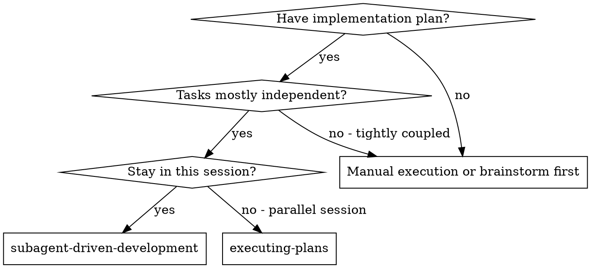
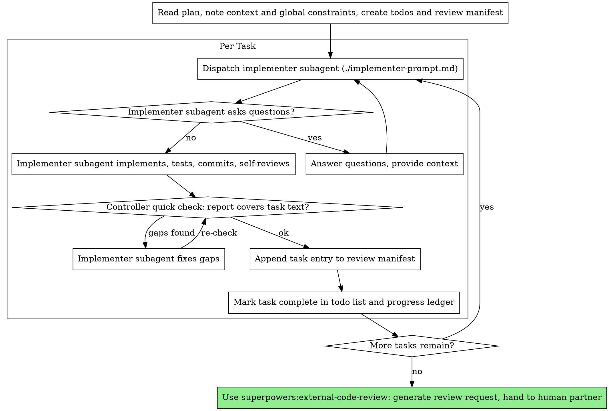

# Subagent-Driven Development

Execute plan by dispatching a fresh implementer subagent per task. Execution is review-free: no reviewer subagents run during the task loop. After all tasks complete, review happens externally via superpowers:external-code-review — you generate the review request, an external model reviews, you apply the results.

**Why subagents:** You delegate tasks to specialized agents with isolated context. By precisely crafting their instructions and context, you ensure they stay focused and succeed at their task. They should never inherit your session's context or history — you construct exactly what they need. This also preserves your own context for coordination work.

**Core principle:** Fresh subagent per task + deferred unified external review = high quality at a fraction of the token cost

**Narration:** between tool calls, narrate at most one short line — the
ledger and the tool results carry the record.

**Continuous execution:** Do not pause to check in with your human partner between tasks. Execute all tasks from the plan without stopping. The only reasons to stop are: BLOCKED status you cannot resolve, ambiguity that genuinely prevents progress, or all tasks complete. "Should I continue?" prompts and progress summaries waste their time — they asked you to execute the plan, so execute it.

## When to Use



**vs. Executing Plans (parallel session):**
- Same session (no context switch)
- Fresh subagent per task (no context pollution)
- Unified external review after all tasks (no per-task reviewer subagents)
- Faster iteration (no human-in-loop between tasks)

## The Process



After the review request is handed off, external review results come back through superpowers:external-code-review Phase 2 (verify findings, dispatch fix subagents, iterate). superpowers:finishing-a-development-branch is invoked from there at convergence — not directly from this skill.

## Pre-Flight Plan Review

Before dispatching Task 1, scan the plan once for conflicts:

- tasks that contradict each other or the plan's Global Constraints
- anything the plan explicitly mandates that would be a defect if implemented as written (a test that asserts nothing, verbatim duplication of a logic block)

Present everything you find to your human partner as one batched question —
each finding beside the plan text that mandates it, asking which governs —
before execution begins, not one interrupt per discovery mid-plan. If the
scan is clean, proceed without comment. The controller quick check and the
external review remain the net for conflicts that only emerge from
implementation.

## The Review Manifest

Create at execution start: `docs/superpowers/reviews/YYYY-MM-DD-<feature>-manifest.md`.

Append one entry **immediately after each task completes** — never reconstruct at the end (long sessions lose detail to context compaction):

```markdown
## Task N: <name>
- Commits: <sha-before>..<sha-after>
- Files: <files changed>
- Requirements: <full task text from the plan>
- Implementer report: <status, what was built, test results, self-review findings, concerns>
```

This file is the raw material for the review request. Its per-task commit ranges are what let the external reviewer attribute findings to tasks — which is why every task must land as its own commit(s), never shared with another task.

Optionally attach a review package for the whole branch when handing off to external-code-review: run this skill's `scripts/review-package MERGE_BASE HEAD` (MERGE_BASE = `git merge-base main HEAD`) and record the printed path in the manifest. The package never enters your own context.

## The Controller Quick Check

After the implementer reports DONE, compare the task's full text (the brief file) against the implementer's report — text vs. text, using what's already in your context. No code reading, no subagent.

Check: Is every requirement in the task text mentioned as implemented? Did they build anything that wasn't requested? If there are gaps, have the implementer fix them before proceeding.

This is a cheap sanity net against obvious omissions, not a review. The real review — reading the actual code — happens externally after all tasks.

## Model Selection

**User-named model wins.** If this conversation named a model for subagents, use that model on every dispatch.

**Otherwise default to Grok 4.6 High-Fast.** This is an explicit standing choice, not a hint. Dispatch every implementer (and fix) subagent with it. In Cursor, pass `model: "cursor-grok-4.6-high-fast"`. Always pass the model field. Do not omit it. Do not pass `inherit`. Omitting the field or passing `inherit` inherits the parent session model and silently ignores this default.

Do not pick a cheaper or "least powerful" model to save cost when the user has not named a model. Grok 4.6 High-Fast is the default for mechanical, integration, and architecture tasks alike.

**If Grok 4.6 High-Fast is not in this harness's available model list,** fall back to the cost/complexity ladder below.

Use the least powerful model that can handle each role to conserve cost and increase speed.

**Mechanical implementation tasks** (isolated functions, clear specs, 1-2 files): use a fast, cheap model. Most implementation tasks are mechanical when the plan is well-specified.

**Integration and judgment tasks** (multi-file coordination, pattern matching, debugging): use a standard model.

**Architecture and design tasks**: use the most capable available model.

**Always specify the model explicitly when dispatching a subagent.** An
omitted model inherits your session's model — often the most capable and
most expensive — which silently defeats this section.

**Turn count beats token price.** Wall-clock and context cost scale with how
many turns a subagent takes, and the cheapest models routinely take 2-3× the
turns on multi-step work — costing more overall. Use a mid-tier model as the
floor for implementers working from prose descriptions.
When the task's plan text contains the complete code to write, the
implementation is transcription plus testing: use the cheapest tier for
that implementer. Single-file mechanical fixes also take the cheapest tier.

**Task complexity signals (implementation tasks):**
- Touches 1-2 files with a complete spec → cheap model
- Touches multiple files with integration concerns → standard model
- Requires design judgment or broad codebase understanding → most capable model

## Handling Implementer Status

Implementer subagents report one of four statuses. Handle each appropriately:

**DONE:** Run the controller quick check, append the manifest entry, mark the task complete in the todo list and progress ledger.

**DONE_WITH_CONCERNS:** The implementer completed the work but flagged doubts. Read the concerns before proceeding. If the concerns are about correctness or scope, address them before moving on. If they're observations (e.g., "this file is getting large"), record them in the manifest entry — the external reviewer will see them — and proceed.

**NEEDS_CONTEXT:** The implementer needs information that wasn't provided. Provide the missing context and re-dispatch.

**BLOCKED:** The implementer cannot complete the task. Assess the blocker:
1. If it's a context problem, provide more context and re-dispatch with the same model
2. If the task requires more reasoning, re-dispatch with a more capable model
3. If the task is too large, break it into smaller pieces
4. If the plan itself is wrong, escalate to the human

**Never** ignore an escalation or force the same model to retry without changes. If the implementer said it's stuck, something needs to change.

## File Handoffs

Everything you paste into a dispatch prompt — and everything a subagent
prints back — stays resident in your context for the rest of the session
and is re-read on every later turn. Hand artifacts over as files:

- **Task brief:** before dispatching an implementer, run this skill's
  `scripts/task-brief PLAN_FILE N` — it extracts the task's full text to a
  uniquely named file and prints the path. Compose the dispatch so the
  brief stays the single source of requirements. Your dispatch should
  contain: (1) one line on where this task fits in the project; (2) the
  brief path, introduced as "read this first — it is your requirements,
  with the exact values to use verbatim"; (3) interfaces and decisions
  from earlier tasks that the brief cannot know; (4) your resolution of
  any ambiguity you noticed in the brief; (5) the report-file path and
  report contract. Exact values (numbers, magic strings, signatures, test
  cases) appear only in the brief.
- **Report file:** name the implementer's report file after the brief
  (brief `…/task-N-brief.md` → report `…/task-N-report.md`) and put it in
  the dispatch prompt. The implementer writes the full report there and
  returns only status, commits, a one-line test summary, and concerns.
- A dispatch prompt describes one task, not the session's history. Do not
  paste accumulated prior-task summaries ("state after Tasks 1-3") into
  later dispatches. A fresh subagent needs its task, the interfaces it
  touches, and the global constraints. Nothing else.

Do not generate a per-task review package or dispatch `task-reviewer-prompt.md`.
That file remains on disk from upstream; this fork does not use it.

## Durable Progress

Conversation memory does not survive compaction. In real sessions,
controllers that lost their place have re-dispatched entire completed task
sequences — the single most expensive failure observed. Track progress in
a ledger file, not only in todos.

- At skill start, check for a ledger:
  `cat "$(git rev-parse --show-toplevel)/.superpowers/sdd/progress.md"`. Tasks listed there
  as complete are DONE — do not re-dispatch them; resume at the first task
  not marked complete.
- When the controller quick check passes, append one line to the ledger in
  the same message as your other bookkeeping:
  `Task N: complete (commits <base7>..<head7>, quick-check ok)`.
- The ledger is your recovery map: the commits it names exist in git even
  when your context no longer remembers creating them. After compaction,
  trust the ledger and `git log` over your own recollection.
- `git clean -fdx` will destroy the ledger (it's git-ignored scratch); if
  that happens, recover from `git log`.

## Prompt Templates

- [implementer-prompt.md](implementer-prompt.md) - Dispatch implementer subagent

(`./task-reviewer-prompt.md` is unused in this fork — per-task review was replaced by superpowers:external-code-review.)

## Example Workflow

```
You: I'm using Subagent-Driven Development to execute this plan.

[Read plan file once: docs/superpowers/plans/feature-plan.md]
[Create todos for all tasks]
[Create manifest: docs/superpowers/reviews/2026-07-19-feature-manifest.md]

Task 1: Hook installation script

[Run task-brief for Task 1; dispatch implementer with brief + report paths + context]

Implementer: "Before I begin - should the hook be installed at user or system level?"

You: "User level (~/.config/superpowers/hooks/)"

Implementer: "Got it. Implementing now..."
[Later] Implementer:
  - Implemented install-hook command
  - Added tests, 5/5 passing
  - Self-review: Found I missed --force flag, added it
  - Committed

[Quick check: report covers all task requirements, nothing extra] ✅
[Append Task 1 entry to manifest]
[Mark Task 1 complete]

Task 2: Recovery modes

[Run task-brief for Task 2; dispatch implementer with brief + report paths + context]

Implementer:
  - Added verify/repair modes
  - 8/8 tests passing
  - Committed

[Quick check: task text requires progress reporting every 100 items —
 report doesn't mention it]

You: "The task requires progress reporting every 100 items. Add it."

Implementer: Added progress reporting, 9/9 tests passing, committed.

[Quick check: ✅]
[Append Task 2 entry to manifest]
[Mark Task 2 complete]

...

[After all tasks]
[Use superpowers:external-code-review Phase 1]

"Review request ready at
docs/superpowers/reviews/2026-07-19-feature-review-request-r1.md.
Run it through your external reviewer and give me the results —
I'll verify and apply them."
```

## Advantages

**vs. Manual execution:**
- Subagents follow TDD naturally
- Fresh context per task (no confusion)
- Parallel-safe (subagents don't interfere)
- Subagent can ask questions (before AND during work)

**vs. Executing Plans:**
- Same session (no handoff)
- Continuous progress (no waiting)

**Efficiency gains:**
- One subagent invocation per task — roughly a third of the dispatches of per-task review
- Review reasoning cost moves entirely to the external model
- Controller curates exactly what context is needed; bulk artifacts move
  as files, not pasted text
- Questions surfaced before work begins (not after)

**Quality gates:**
- Implementer self-review catches issues before handoff
- Controller quick check catches spec omissions at near-zero cost
- Per-task commits + manifest make the external review precise and attributable
- Unified review sees cross-task consistency that per-task review structurally cannot

**Cost:**
- Controller does more prep work (extracting all tasks upfront, maintaining the manifest)
- External review round-trips involve your human partner (the trade for token savings)
- Issues surface after all tasks instead of between tasks — the plan's small-task granularity and per-task tests keep that risk bounded

## Red Flags

**Never:**
- Start implementation on main/master branch without explicit user consent
- Dispatch reviewer subagents during execution (review is external, after all tasks)
- Review the code yourself between tasks (that's the external reviewer's job — and your context budget)
- Skip the controller quick check or proceed while it has open gaps
- Skip or batch-defer manifest entries (append immediately after each task)
- Let two tasks share a commit (per-task commits are what make external review attributable)
- Skip external review after the last task ("the tasks were simple" is not a reason)
- Let implementer self-review replace the external review (both are needed)
- Dispatch multiple implementation subagents in parallel (conflicts)
- Make a subagent read the whole plan file (hand it its task brief —
  `scripts/task-brief` — instead)
- Skip scene-setting context (subagent needs to understand where task fits)
- Ignore subagent questions (answer before letting them proceed)
- Re-dispatch a task the progress ledger already marks complete — check
  the ledger (and `git log`) after any compaction or resume
- Omit the model field, pass `inherit`, or pick a cheaper model when the
  user has not named one (the default is Grok 4.6 High-Fast)

**If subagent asks questions:**
- Answer clearly and completely
- Provide additional context if needed
- Don't rush them into implementation

**If the quick check finds gaps:**
- Implementer (same subagent) fixes them
- Re-check against the task text
- Don't carry known gaps forward "for the external reviewer to catch"

**If subagent fails task:**
- Dispatch fix subagent with specific instructions
- Don't try to fix manually (context pollution)

## Integration

**Required workflow skills:**
- **superpowers:using-git-worktrees** - Ensures isolated workspace (creates one or verifies existing)
- **superpowers:writing-plans** - Creates the plan this skill executes
- **superpowers:external-code-review** - Unified review after all tasks: generates the review request, applies external results
- **superpowers:finishing-a-development-branch** - Invoked from external-code-review at review convergence

**Subagents should use:**
- **superpowers:test-driven-development** - Subagents follow TDD for each task

**Alternative workflow:**
- **superpowers:executing-plans** - Use for parallel session instead of same-session execution
